# HDS Onderhoudsdiensten — Solution Architecture

**Document ID:** SA-001 | **Version:** 3.0.0 | **Status:** Final — Implementation Blueprint
**Project:** helderduidelijkschoon.nl — Ground-Up Rebuild
**Language:** Nederlands (nl-NL) | **Date:** July 2026
**Supersedes:** SAD-001 (v2.0.0), ADR-001 (v1.0.0)
**Referenced Documents:** MPS-001, RTM-001, FS-001, NFR-001, PB-001, PVR-001, Epic 1 Implementation, Epic 2 Implementation

---

## 1. Executive Summary

This Solution Architecture document is the definitive technical blueprint for rebuilding `helderduidelijkschoon.nl`. It consolidates all architectural decisions from the Architecture Decision Record (ADR-001), reflects corrections from the Project Validation Review (PVR-001), and provides implementation-ready specifications for the development team.

**System Identity:**
- **Domain:** https://helderduidelijkschoon.nl/ (canonical: non-www, HTTPS, trailing slash)
- **Language:** nl-NL, single-language (all strings internationalized via `__()` / `_e()`)
- **CMS:** WordPress 6.7+ with custom hybrid block theme (`hds`)
- **eCommerce:** WooCommerce 9.x+ (14 Airfixr products — conditional on client decision MI-15/Q09)
- **Target Pages:** 32 total (12 built in Sprint 2 MVP; 20 in Sprints 3–5)
- **Service Area:** West-Brabant / Zeeland
- **Hosting:** Managed WordPress (Kinsta/WP Engine/Cloud86) + Cloudflare CDN

**Architecture Type:** Monolithic WordPress application with edge caching via Cloudflare CDN. NOT headless. This is the correct architecture for a 32-page B2B site with modest traffic (<100 concurrent users).

**Key Post-PVR Corrections Applied:**
- `hds_faq` CPT removed — FAQ uses Yoast/Rank Math FAQ Block on standard Page
- `hds_vacancy` has_archive confirmed as `false` — vacancies display on `/vacatures/` Page via block
- 9 remaining block patterns documented as implemented via custom blocks or block compositions
- PB story count reconciled

---

## 2. Architecture Goals

| # | Goal | Metric |
|---|---|---|
| AG01 | **Restore lead capture** — working contact + quote forms | Form submissions delivered to info@ within 2 minutes |
| AG02 | **Zero technical debt** — complete rebuild, no code carried forward | All software on latest stable versions |
| AG03 | **No page builder lock-in** — Native Block Editor only | Zero shortcodes in `post_content` |
| AG04 | **Performance by default** | PSI Mobile ≥ 90, Desktop ≥ 95 at Sprint 7 QA gate |
| AG05 | **Security in depth** — 6-layer defense model | All 16 SEC requirements met; XML-RPC disabled; 2FA enforced |
| AG06 | **Full GDPR/AVG compliance** | Privacyverklaring published; cookie consent active; KVK/BTW displayed |
| AG07 | **SEO foundation** — unique meta, valid schema, working sitemap | 32 unique titles/descriptions; 9 schema types validated; sitemap returns 200 |
| AG08 | **WCAG 2.2 AA accessibility** | Lighthouse Accessibility = 100; axe DevTools zero critical/serious |
| AG09 | **Client self-sufficiency** — edit all content via Block Editor | Client trained; Beheergids delivered (Sprint 8) |
| AG10 | **Automated deployment** — Git push → deploy | CI/CD pipeline from GitHub Actions to staging/production |

---

## 3. Architectural Principles

| # | Principle | Implementation Rule |
|---|---|---|
| P1 | **Rebuild, Don't Repair** | Zero code, zero config, zero decisions carry forward from old site |
| P2 | **No Page Builder Lock-In** | Native Block Editor ONLY — any page builder is a violation |
| P3 | **Content Portability** | All content as standard Block HTML; no shortcodes in `post_content` |
| P4 | **Performance by Default** | PSI 90+/95+ mandatory at QA gate; performance is architecture, not optimization |
| P5 | **Security in Depth** | 6-layer model (Transport → CDN → Server → Auth → WAF → App Logic) |
| P6 | **Dutch-First** | `lang="nl-NL"`; all UI strings in Dutch; no translation plugins |
| P7 | **Mobile-First CSS** | `min-width` media queries; touch targets ≥ 44px |
| P8 | **Progressive Enhancement** | Core functionality (nav, forms, content) works without JavaScript |
| P9 | **Client Self-Sufficiency** | Block Editor for all content; GF admin for forms; WC admin for shop |
| P10 | **Everything is Traced** | 274 requirements fully mapped in RTM-001 |
| P11 | **Documentation as Code** | All decisions in ADR; all specs in FS/NFR; all tasks in PB |
| P12 | **Environment Parity** | Local ≈ Staging ≈ Production — identical PHP, WP, and plugin versions |

---

## 4. High-Level Solution Architecture

### 4.1 System Context Diagram

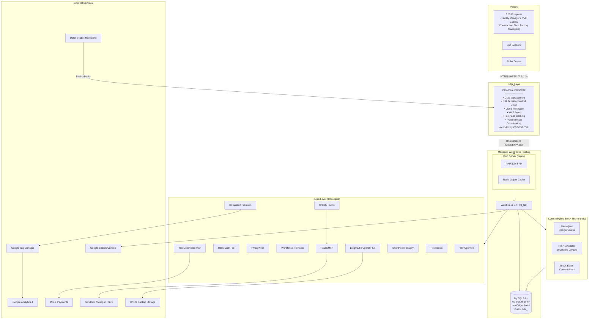

### 4.2 Technology Stack

| Layer | Technology | Version | Purpose |
|---|---|---|---|
| **Edge** | Cloudflare | Free/Pro | DNS, CDN, SSL, WAF, DDoS, Caching |
| **Hosting** | Managed WP (Kinsta/WPE/Cloud86) | — | PHP workers, Nginx, Redis, MySQL |
| **CMS** | WordPress | 6.7+ | Content management, user management |
| **Language Runtime** | PHP | 8.2+ | Application execution |
| **Database** | MySQL or MariaDB | 8.0+ / 10.6+ | Persistent data (InnoDB, utf8mb4) |
| **Object Cache** | Redis | 7+ | Query/transient/option caching |
| **Theme** | Custom Hybrid Block (`hds`) | 1.0.0 | Presentation layer |
| **eCommerce** | WooCommerce | 9.x+ | Shop, cart, checkout, orders |
| **Forms** | Gravity Forms | latest | Contact, quote, job applications |
| **SEO** | Rank Math Pro | latest | Meta, sitemaps, schema, redirects |
| **Caching** | FlyingPress + Redis | latest | Page cache + CSS/JS optimization |
| **Cookie Consent** | Complianz Premium | latest | GDPR/AVG consent management |
| **Security** | Wordfence Premium | latest | WAF, 2FA, malware scan, brute force |
| **SMTP** | Post SMTP | latest | Email delivery via SendGrid/Mailgun/SES |
| **Backups** | BlogVault / UpdraftPlus | latest | Daily automated offsite backups |
| **Images** | ShortPixel / Imagify | latest | Auto WebP conversion, compression |
| **Search** | Relevanssi | latest | Dutch-language fulltext search |
| **Maintenance** | WP-Optimize | latest | Database cleanup, revisions management |
| **Analytics** | GA4 via GTM | latest | Traffic, events, conversions |
| **Monitoring** | UptimeRobot | free | 5-minute uptime checks |
| **CI/CD** | GitHub Actions | — | Automated deployment pipeline |
| **Version Control** | Git (GitHub) | — | All custom theme + plugin code |

---

## 5. Logical Architecture

### 5.1 Layer Diagram

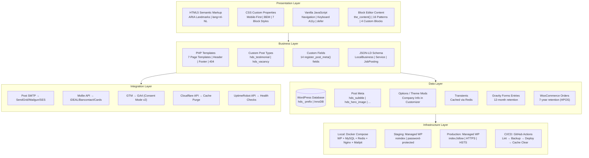

### 5.2 Layer Responsibilities

| Layer | Responsibility | Key Technologies |
|---|---|---|
| **Presentation** | Render HTML, apply styles, handle client-side interactions | theme.json, main.css, main.js, Block Editor |
| **Business** | Page routing, template selection, content queries, schema generation | PHP templates, WP_Query, CPTs, custom blocks |
| **Data** | Persistent storage, caching, form entries, orders | MySQL, Redis, Post Meta, Options API, Gravity Forms DB |
| **Infrastructure** | Environment management, deployment, monitoring | Docker, Managed WP Hosting, GitHub Actions, Cloudflare |
| **Integration** | External service communication | Post SMTP, Mollie API, GTM/GA4, Cloudflare API, UptimeRobot |

---

## 6. Component Architecture

### 6.1 Component Inventory

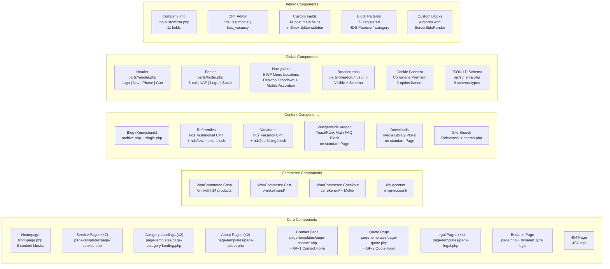

### 6.2 Component Responsibility Matrix

| Component | Primary Responsibility | Dependencies |
|---|---|---|
| **Homepage** | Primary landing page. 8 content blocks. Service discovery + lead generation. | Theme foundation, block patterns, custom blocks |
| **Service Pages** | Detailed service information. Consistent layout. Cross-sells. CTA. | Service template, custom fields, cross-sell pattern |
| **Category Landings** | SEO landing pages. Aggregate sub-service cards. | Category landing template, service card block |
| **Contact Page** | Lead capture via GF-1 form. Company info display. | Contact template, Gravity Forms, Customizer |
| **Quote Page** | Qualified lead capture via GF-2 form. File upload. | Quote template, Gravity Forms, Customizer |
| **WooCommerce** | Airfixr product sales. Cart, checkout, Mollie payments. | WooCommerce plugin, Mollie plugin, SMTP |
| **Forms (All 3)** | Data capture. Email notifications. Spam protection. | Gravity Forms, Post SMTP, reCAPTCHA |
| **SEO (Rank Math)** | Metadata, sitemaps, schema, redirects, robots.txt | All pages must exist before SEO configuration |
| **Blog** | Content marketing. Topic authority for cleaning terms. | Standard WP Posts, category base `kennisbank` |
| **Search** | Fulltext search across pages, posts, vacancies | Relevanssi plugin, search.php template |
| **Navigation** | Site-wide discoverability. Desktop + mobile + footer. | 5 WP menu locations, CSS, JavaScript |
| **Header** | Brand identity. Primary navigation. Contact links. | Logo, WP menus, Customizer (phone/email) |
| **Footer** | Secondary navigation. Legal links. NAP. Social. | WP menus, Customizer, legal pages |
| **Schema** | Structured data for search engines. 9 types. | Customizer (company info), post meta, page content |
| **Authentication** | User login security. 2FA. Brute force protection. | Wordfence, custom login URL, WP user system |
| **Admin** | Content management. Form entry review. Order management. | WP Admin, Gravity Forms admin, WooCommerce admin |

---

## 7. Data Flow

### 7.1 Primary Conversion Flow (Visitor → Lead)

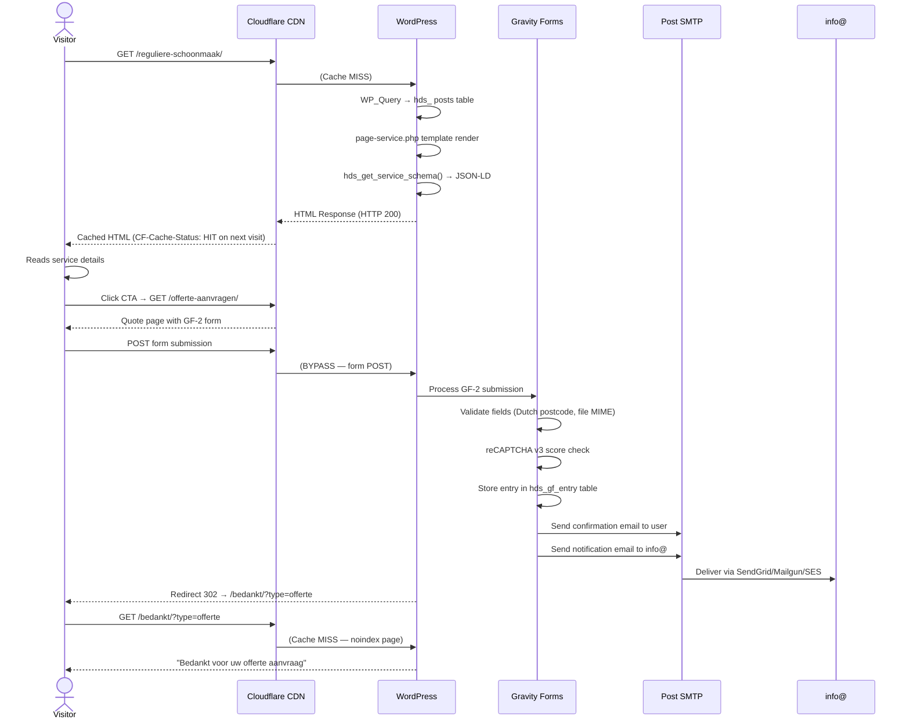

### 7.2 WooCommerce Purchase Flow (Visitor → Order)

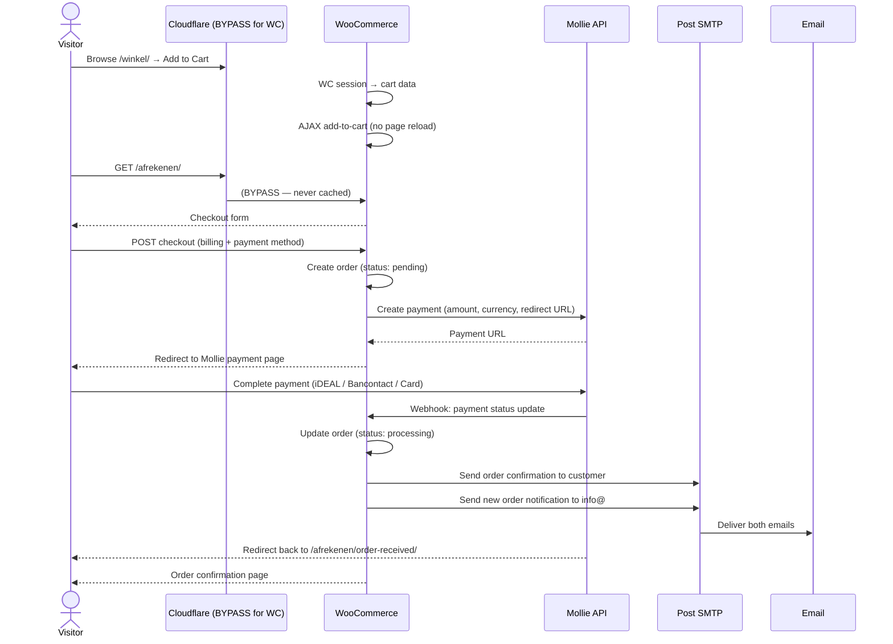

### 7.3 Search Flow

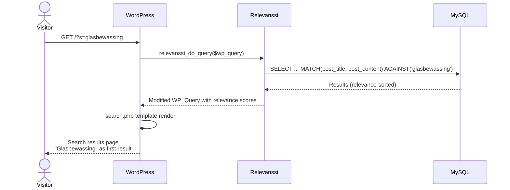

---

## 8. Request Lifecycle

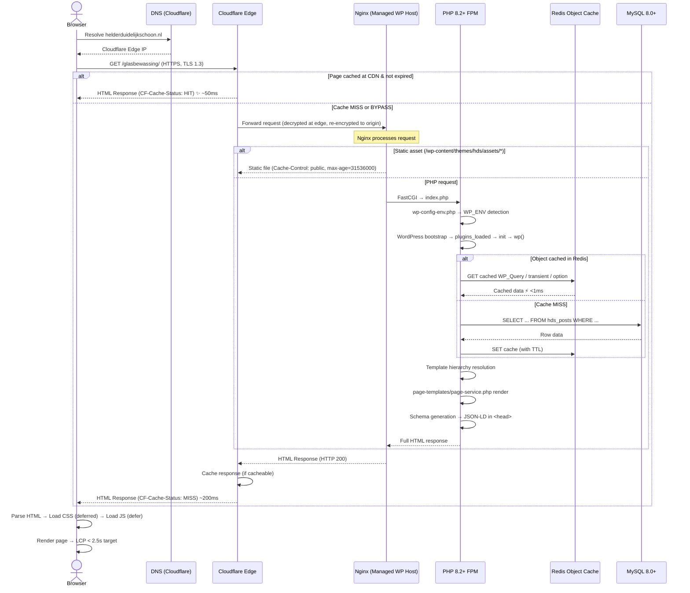

### 8.1 Cache Decision Tree

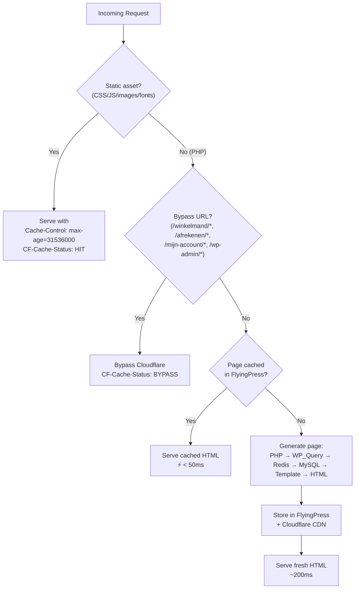

---

## 9. Plugin Responsibilities

### 9.1 Plugin Inventory & Responsibilities

| # | Plugin | License | Critical? | Responsibility | Key Interactions |
|---|---|---|---|---|---|
| 1 | **WooCommerce 9.x+** | Free | Conditional | eCommerce: products, cart, checkout, orders, HPOS | Mollie plugin, Cloudflare (cache bypass), SMTP |
| 2 | **Gravity Forms** | Premium | **Yes** | All 3 forms (GF-1 Contact, GF-2 Offerte, GF-3 Vacature). Entry storage. reCAPTCHA v3. | SMTP (email delivery), reCAPTCHA API |
| 3 | **Rank Math Pro** | Premium | **Yes** | Meta titles/descriptions, XML sitemaps, robots.txt, canonical URLs, OpenGraph, Twitter Cards, auto-schema (WebSite, WebPage, BreadcrumbList, Article, Product), 301 redirect manager, 404 monitor | Theme schema (complementary; no duplication) |
| 4 | **FlyingPress** | Premium | **Yes** | Page caching, critical CSS generation, unused CSS removal, JS deferral, font optimization | Cloudflare API (cache purge), Redis |
| 5 | **Complianz Premium** | Premium | **Yes** | Cookie consent banner (Dutch), per-category consent, consent logging, GTM consent mode v2 signals, Cookiebeleid page auto-generation | GTM (consent signals), GA4, Google Maps (consent placeholder) |
| 6 | **Wordfence Premium** | Premium | **Yes** | WAF, daily malware scan, file integrity monitoring, 2FA (TOTP), brute force protection (3 attempts → lockout), custom login URL, login security | WordPress authentication system |
| 7 | **Post SMTP** | Free | **Yes** | Email delivery via SendGrid/Mailgun/SES. SPF/DKIM/DMARC verification. Email logging. | Gravity Forms, WooCommerce, WordPress emails |
| 8 | **BlogVault / UpdraftPlus** | Premium | **Yes** | Daily automated full backups (files + database). Offsite cloud storage. One-click restore. WC monthly CSV export. | Cloud storage (Google Drive/Dropbox/S3), staging environment |
| 9 | **ShortPixel / Imagify** | Premium | No | Auto WebP conversion on upload. Lossy/glossy compression (quality 85+). Bulk optimization. | WordPress Media Library |
| 10 | **Relevanssi** | Free | No | Dutch-language fulltext search. Indexes: pages, posts, hds_vacancy CPT. Relevance sorting. | WP_Query (via relevanssi_do_query filter) |
| 11 | **WP-Optimize** | Free | No | Database cleanup: revisions (>30 days), spam, transients, orphaned meta. Scheduled optimization. | MySQL |
| 12 | **Mollie for WooCommerce** | Free | Conditional | Payment processing: iDEAL, Bancontact, credit cards, PayPal, SEPA. Webhook for order status updates. | WooCommerce, Mollie API |
| 13 | **Google Site Kit** (optional) | Free | No | GA4 + GSC + AdSense dashboard in WP Admin. Connects Google services. | GA4, GSC |

### 9.2 Plugin Interaction Diagram

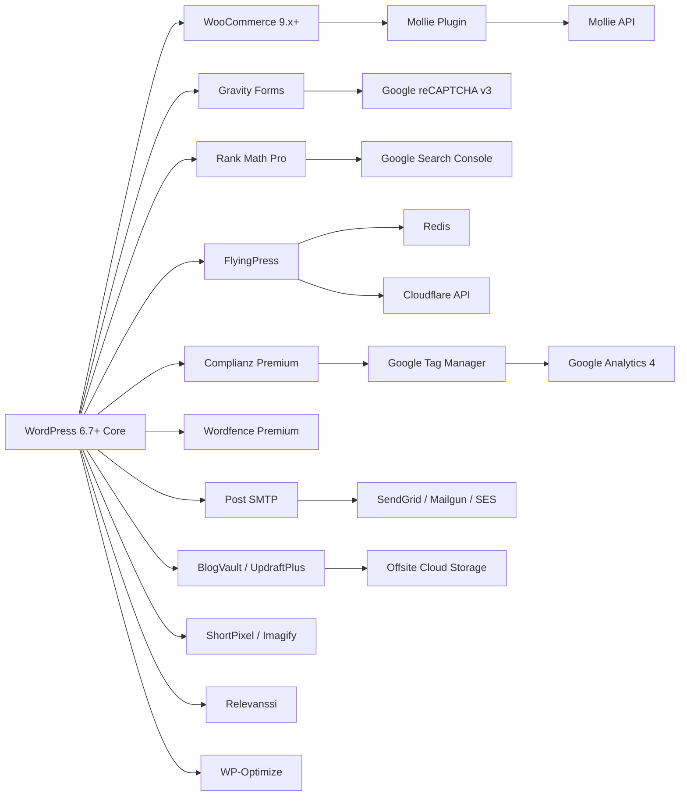

---

## 10. Theme Responsibilities

### 10.1 Theme Architecture

**Type:** Custom Hybrid Block Theme — uses `theme.json` for design tokens + PHP templates for structured layouts + Block Editor for content areas. NOT Full Site Editing.

### 10.2 Theme File Map

```
wp-content/themes/hds/
├── theme.json                     # Design tokens, block styles, custom templates, spacing/shadow/color presets
├── style.css                      # Theme metadata (Theme Name, Author, Version, Text Domain)
├── screenshot.png                 # 1200×900 theme preview
├── functions.php                  # Bootstrap: constants, theme setup, enqueue, block styles, patterns category, require inc/*
│
├── assets/
│   ├── css/
│   │   ├── main.css               # Production styles: reset, typography, layout, components, blocks, responsive
│   │   └── editor.css             # Block Editor styles: mirror of frontend styles for WYSIWYG editing
│   ├── js/
│   │   ├── main.js                # Navigation toggle, keyboard a11y (Escape to close menu)
│   │   └── blocks/                # 4 block editor scripts (ServerSideRender)
│   │       ├── service-card.js
│   │       ├── testimonial.js
│   │       ├── job-listing.js
│   │       └── contact-info.js
│   ├── images/                    # Theme images (logo.svg placeholder)
│   └── fonts/                     # Self-hosted Open Sans (WOFF2, subset Latin + Dutch diacritics)
│
├── inc/
│   ├── setup.php                  # Image sizes, disable unused WP features, theme activation hook
│   ├── cpts.php                   # CPT registration: hds_testimonial (non-public), hds_vacancy (public, archive=false)
│   ├── custom-fields.php          # 14 register_post_meta() calls (Service, Testimonial, Vacancy)
│   ├── customizer.php             # 11 Company Information fields in Theme Customizer
│   ├── helpers.php                # get_header(), get_footer(), hds_get_phone(), hds_get_email(), hds_breadcrumbs()
│   ├── security.php               # XML-RPC disable, REST user block, author/attachment redirects, version removal
│   ├── patterns.php               # 7+ block patterns (register_block_pattern)
│   ├── blocks.php                 # 4 custom blocks with PHP render_callbacks
│   └── schema.php                 # 5 JSON-LD generators: Organization, LocalBusiness, Service, FAQPage, JobPosting
│
├── parts/
│   ├── header.php                 # DOCTYPE → <head> → <body> → skip-link → <header>: logo, nav, phone, cart icon
│   ├── footer.php                 # 5-col grid → NAP/KVK/BTW → social → copyright → cookie settings → wp_footer()
│   ├── breadcrumbs.php            # BreadcrumbList with Schema.org microdata
│   └── schema-localbusiness.php   # LocalBusiness JSON-LD (used on Home, Contact, Over HDS)
│
├── page-templates/
│   ├── page-service.php           # P02–P08: Breadcrumbs → Hero → Content → Cross-Sell → CTA → FAQ
│   ├── page-category-landing.php  # P09, P10: Hero → Intro → Service Card Grid → CTA
│   ├── page-about.php             # P11, P12: Hero → Content → CTA
│   ├── page-contact.php           # P16: Two-column (form 60% + contact info 40%)
│   ├── page-quote.php             # P17: Full-width quote form
│   ├── page-faq.php               # P18: H1 → FAQ blocks (Yoast/Rank Math)
│   └── page-legal.php             # P19–P22: H1 → Content → Last Updated date
│
├── front-page.php                 # P01: the_content() → all 8 blocks via Block Editor
├── page.php                       # Default: H1 + the_content (P13–P15, P23, P32)
├── single.php                     # Blog post: breadcrumbs → featured image → H1 → meta → content → related posts
├── archive.php                    # Blog index: H1 → post grid → pagination
├── search.php                     # Search results: H1 → results list → pagination → no-results fallback
├── 404.php                        # Custom 404: heading → search bar → key links → phone → email
├── index.php                      # Ultimate fallback
└── languages/
    └── hds.pot                    # POT file for translations
```

### 10.3 Theme Responsibilities Summary

| Responsibility | Implementation |
|---|---|
| **Design Tokens** | `theme.json` — color palette (11 colors), typography (Open Sans, 9 font sizes), spacing (13 sizes), shadows (4 presets) |
| **Templates** | 7 custom page templates + 5 standard templates (front-page, page, single, archive, search, 404, index) |
| **Navigation** | 5 WP menu locations registered (primary, footer-services, footer-about, footer-airfixr, footer-legal) |
| **Block Styles** | 7 variations: `is-style-secondary`, `is-style-cta`, `is-style-card`, `is-style-banner`, `is-style-icon-list`, `is-style-no-bullet` (+ `is-style-primary` on core/button) |
| **Block Patterns** | 7+ registered in `inc/patterns.php`; categorized under "HDS Patronen" |
| **Custom Blocks** | 4: `hds/service-card`, `hds/testimonial`, `hds/job-listing`, `hds/contact-info` — each with editor JS + PHP render callback |
| **Schema** | 5 JSON-LD generators in `inc/schema.php`; output via `wp_head` priority 5 |
| **Security** | `inc/security.php`: XML-RPC disabled, REST user endpoint blocked, author/attachment redirects, WP version removed |
| **Customizer** | 11 company info fields (address, postal, phone, email, KVK, BTW, Facebook, Instagram, GBP, hours) |
| **Custom Fields** | 14 `register_post_meta()` fields (4 service + 4 testimonial + 6 vacancy) — REST-accessible for Block Editor |
| **Asset Loading** | CSS: `wp_enqueue_style()` with `filemtime()` versioning. JS: `wp_enqueue_script()` with `defer` and `$in_footer=true`. |
| **Image Sizes** | 3 custom: `hds-card` (400×300 crop), `hds-content` (800×600), `hds-hero` (1600×900 crop) |

---

## 11. Template Hierarchy

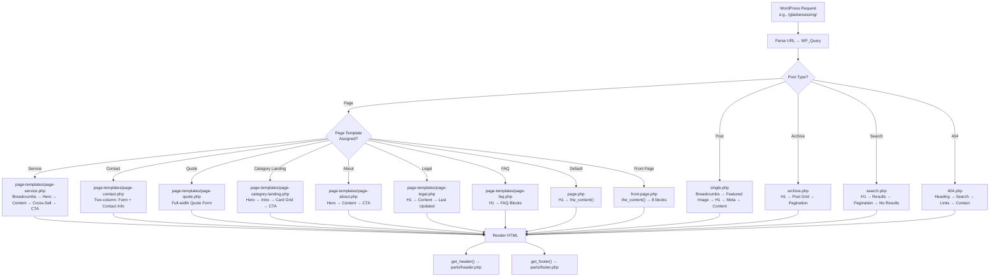

### Template-to-Page Mapping

| Template File | Applied To | Pages | Priority |
|---|---|---|---|
| `front-page.php` | Front page (Settings → Reading) | P01 (Home) | P0 |
| `page-templates/page-service.php` | Page template "Service" | P02–P08 | P0 |
| `page-templates/page-category-landing.php` | Page template "Category Landing" | P09, P10 | P1 |
| `page-templates/page-about.php` | Page template "About" | P11, P12 | P0 |
| `page-templates/page-contact.php` | Page template "Contact" | P16 | P0 |
| `page-templates/page-quote.php` | Page template "Offerte Aanvragen" | P17 | P1 |
| `page-templates/page-faq.php` | Page template "FAQ" | P18 | P2 |
| `page-templates/page-legal.php` | Page template "Legal" | P19–P22 | P0 |
| `page.php` | Default template | P13–P15, P23, P32 | P1 |
| `single.php` | Single post | P30 (blog posts) | P2 |
| `archive.php` | Archive / Blog index | P29 (Kennisbank) | P2 |
| `search.php` | Search results | — | P0 |
| `404.php` | 404 errors | P31 | P0 |
| `index.php` | Ultimate fallback | — | Fallback |
| WooCommerce templates | Plugin directory | P24–P28 | P1 |

---

## 12. Performance Architecture

### 12.1 4-Layer Cache Strategy

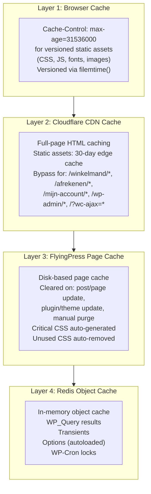

### 12.2 Performance Budgets (Hard Gates)

| Metric | Target | Tool |
|---|---|---|
| LCP | < 2.5s | PSI, Lighthouse |
| INP | < 200ms | PSI, Chrome UX Report |
| CLS | < 0.1 | PSI, Lighthouse |
| TTFB | < 600ms | WebPageTest (Amsterdam, Moto G4, 3G Fast) |
| Speed Index | < 3.4s | Lighthouse |
| Total Page Weight (Mobile) | < 1.5 MB | WebPageTest |
| Total Page Weight (Desktop) | < 3.0 MB | WebPageTest |
| PSI Mobile Score | ≥ 90 | PSI |
| PSI Desktop Score | ≥ 95 | PSI |
| Lighthouse Accessibility | 100 | Lighthouse |
| Lighthouse Best Practices | 100 | Lighthouse |
| Lighthouse SEO | 100 | Lighthouse |

### 12.3 Asset Delivery Strategy

| Asset Type | Strategy |
|---|---|
| **CSS** | Critical CSS inlined in `<head>` (FlyingPress auto). Non-critical CSS deferred. One main.css file (modular sections via comments). |
| **JavaScript** | `defer` attribute on all scripts. No render-blocking JS. jQuery removed unless WooCommerce requires it. jQuery Migrate NEVER loaded. |
| **Fonts** | Self-hosted Open Sans (WOFF2, subset Latin + Dutch diacritics). `font-display: swap`. Preloaded in `<head>`. Total font weight < 100 KB. |
| **Images** | WebP primary via `<picture>`. PNG/JPEG fallback. `srcset` (400w, 800w, 1200w). Explicit dimensions. `loading="lazy"` below fold. `fetchpriority="high"` on LCP. Compression quality 85+. |
| **HTML** | Gzip/Brotli via Cloudflare. Auto-minify enabled. |

---

## 13. Security Architecture

### 13.1 6-Layer Defense Model

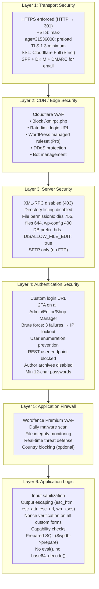

### 13.2 Hard Constraints

- No `eval()`, no `base64_decode()`, no `extract()` in any theme code
- All output escaped based on context (`esc_html()`, `esc_attr()`, `esc_url()`, `wp_kses()`)
- All inputs sanitized before storage (`sanitize_text_field()`, `sanitize_email()`, etc.)
- All custom forms protected by WordPress nonces
- All database queries use `$wpdb->prepare()` for user input
- Database prefix changed from `wp_` to `hds_`
- Admin usernames never "admin", "hds", or "helderduidelijkschoon"
- No nulled or cracked plugins — official sources only
- Application passwords disabled

---

## 14. SEO Architecture

### 14.1 SEO Components

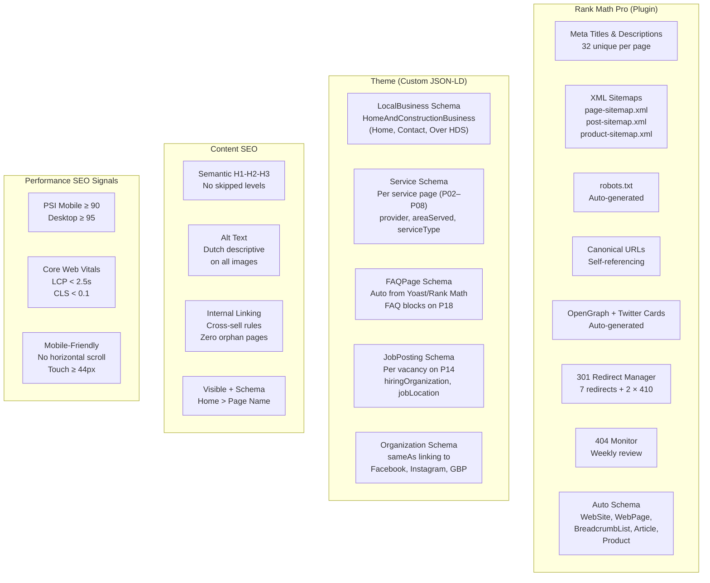

### 14.2 Schema Coverage (9 Types)

| Schema Type | Source | Pages | Validation |
|---|---|---|---|
| `WebSite` + `SearchAction` | Rank Math auto | All | — |
| `WebPage` | Rank Math auto | All | — |
| `BreadcrumbList` | Rank Math + theme | All inner pages | Google Rich Results Test |
| `Organization` + `sameAs` | Theme (`schema.php`) | All | Google Rich Results Test |
| `LocalBusiness` (HomeAndConstructionBusiness) | Theme (`schema.php`) | Home, Contact, Over HDS | Google Rich Results Test |
| `Service` | Theme (`schema.php`) | P02–P08 (×7) | Google Rich Results Test |
| `FAQPage` | Rank Math auto (FAQ blocks) | P18 | Google Rich Results Test |
| `Product` | WooCommerce auto | P25 (×14) | Google Rich Results Test |
| `JobPosting` | Theme (`schema.php`) | Per vacancy on P14 | Google Rich Results Test |

### 14.3 301 Redirect Map

| Old URL | New URL / Status |
|---|---|
| `/glasbewassing` (no slash) | 301 → `/glasbewassing/` |
| `/vve` | 301 → `/vve-service/` |
| `/vve/` | 301 → `/vve-service/` |
| `/?page_id=318` | 301 → `/reguliere-schoonmaak/` |
| `http://helderduidelijkschoon.nl/*` | 301 → `https://helderduidelijkschoon.nl/*` |
| `http://www.helderduidelijkschoon.nl/*` | 301 → `https://helderduidelijkschoon.nl/*` |
| `https://www.helderduidelijkschoon.nl/*` | 301 → `https://helderduidelijkschoon.nl/*` |
| `/2015/06/29/hallo-wereld/` | 410 Gone |
| `/2015/08/25/kwaliteit-veiligheid/` | 410 Gone |

---

## 15. Content Architecture

### 15.1 Content Storage Model

```
WordPress Database (hds_ prefix)
│
├── hds_posts
│   ├── post_type = 'page' (26 pages: P01–P23, P31–P32 + system pages)
│   │   ├── post_content = Block HTML (<!-- wp:paragraph -->...<!-- /wp:paragraph -->)
│   │   ├── post_title = Page title (NL)
│   │   └── post_name = URL slug
│   ├── post_type = 'post' (5–10 blog posts: P29–P30)
│   ├── post_type = 'hds_testimonial' (testimonials, non-public)
│   └── post_type = 'hds_vacancy' (vacancies, public but no archive)
│
├── hds_postmeta
│   ├── hds_subtitle, hds_hero_image, hds_service_icon, hds_cta_override (Service pages)
│   ├── hds_author_name, hds_company_name, hds_star_rating, hds_related_service (Testimonials)
│   └── hds_hours_per_week, hds_location, hds_start_date, hds_application_email,
│       hds_deadline, hds_is_active (Vacancies)
│
├── hds_options
│   ├── theme_mods_hds → Customizer values (address, phone, email, KVK, BTW, etc.)
│   └── rank_math_* → SEO plugin settings
│
├── hds_gf_form / hds_gf_entry / hds_gf_entry_meta (Gravity Forms)
├── hds_wc_orders / hds_wc_order_addresses (WooCommerce HPOS)
└── hds_relevanssi / hds_relevanssi_log (Search index)
```

### 15.2 Content Types & Minimums

| Content Type | WP Type | Editor | Min Words | Template |
|---|---|---|---|---|
| Service page | Page | Block Editor | 300+ | Service |
| Category landing | Page | Block Editor | 500+ | Category Landing |
| About page | Page | Block Editor | 300–500+ | About |
| Contact / Quote | Page + Gravity Forms shortcode | Block Editor | 150+ | Contact / Quote |
| Legal page | Page | Block Editor | 150–500+ | Legal |
| Blog post | Post | Block Editor | 500+ | Single |
| FAQ | Page + Yoast/Rank Math FAQ blocks | Block Editor | 300+ combined | FAQ |
| Testimonial | `hds_testimonial` CPT | WP Admin | Quote text | — (block-queried) |
| Vacancy | `hds_vacancy` CPT | WP Admin | Description | — (block-queried) |
| Company info | Customizer | Customizer UI | N/A | — (theme_mod) |
| Navigation | WP Menu System | Appearance → Menus | N/A | — (wp_nav_menu) |
| Forms | Gravity Forms | GF Admin | N/A | — (shortcode/block) |

---

## 16. Deployment Architecture

### 16.1 CI/CD Pipeline

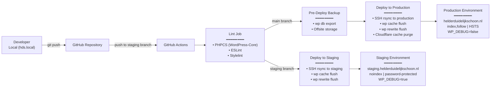

### 16.2 Environment Configuration

| Setting | Local | Staging | Production |
|---|---|---|---|
| **URL** | `hds.local` | `staging.helderduidelijkschoon.nl` | `helderduidelijkschoon.nl` |
| **PHP** | 8.2+ | 8.2+ (prod mirror) | 8.2+ |
| **WP_DEBUG** | `true` | `true` | `false` |
| **WP_DEBUG_DISPLAY** | `false` | `false` | `false` |
| **WP_DEBUG_LOG** | `true` | `true` | `true` |
| **Indexing** | N/A | `noindex, nofollow` | `index, follow` |
| **Access** | Developer only | Developer + Client (password) | Public + Developer + Client (admin) |
| **Object Cache** | Redis (Docker) | Redis (hosting) | Redis (hosting) |
| **Page Cache** | Disabled (dev) | FlyingPress (test) | FlyingPress (active) |
| **CDN** | None | Cloudflare (test) | Cloudflare (active) |
| **SSL** | None | Cloudflare Full (Strict) | Cloudflare Full (Strict) |
| **Email** | Mailpit (catch-all) | Post SMTP (test mode) | Post SMTP (live) |
| **Payments** | N/A | Mollie (test mode) | Mollie (live) |

### 16.3 Deployment Workflow

1. **Local Development** — Developer works on `hds.local` (Docker). All changes committed to feature branches.
2. **Staging Deployment** — Merge to `staging` branch → GitHub Actions auto-deploys to staging. Developer and client QA.
3. **Client Approval** — Client reviews and signs off on staging.
4. **Production Deployment** — Merge `staging` → `main` → GitHub Actions: pre-deploy backup → deploy → clear caches → smoke tests.
5. **Rollback** — Restore pre-deploy backup to staging → verify → deploy to production. RTO < 30 minutes for plugin updates, < 2 hours for complete site failure.

---

## 17. Monitoring Architecture

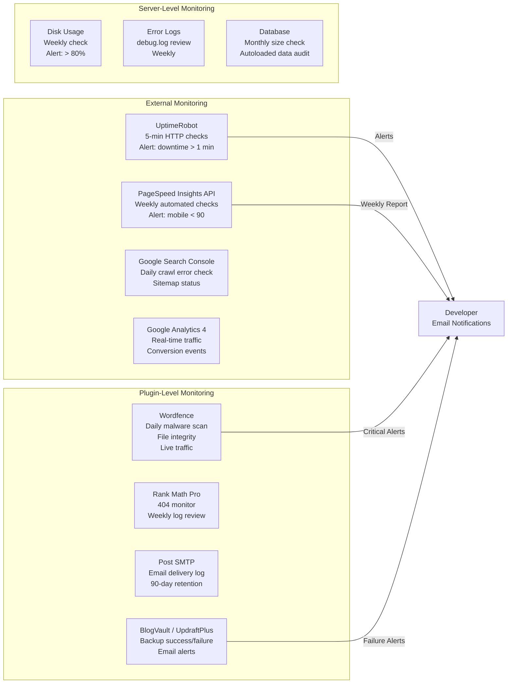

### 17.1 Alert Configuration

| Trigger | Recipient | Channel | Frequency |
|---|---|---|---|
| Downtime > 1 minute | Developer + Client | Email (UptimeRobot) | Real-time |
| SSL expiry < 30 days | Developer | Email (UptimeRobot + Cloudflare) | Daily check |
| Backup failure | Developer | Email (backup plugin) | Real-time on failure |
| Malware detected | Developer | Email (Wordfence) | Real-time on detection |
| Disk > 80% | Developer | Email (hosting) | Weekly check |
| PSI mobile < 90 | Developer | Manual report | Weekly check |
| 404 spike | Developer | Rank Math dashboard | Weekly review |

---

## 18. Backup Architecture

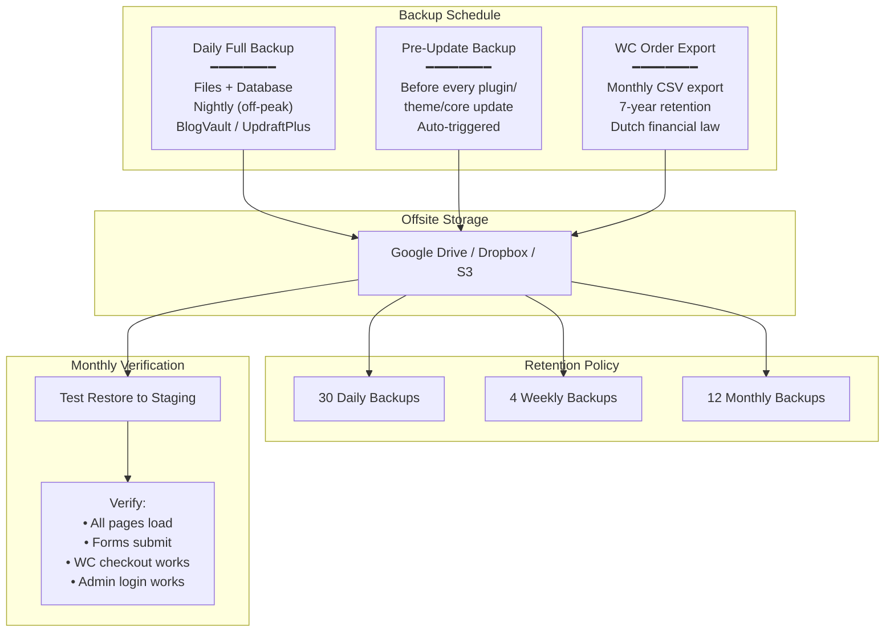

### 18.1 Recovery Objectives

| Scenario | RTO | RPO |
|---|---|---|
| Server failure (hosting outage) | < 4 hours | < 24 hours |
| Malware / defacement | < 4 hours | < 24 hours |
| Accidental content deletion | < 1 hour (revision) / < 4 hours (restore) | < 24 hours |
| DNS / domain issue | < 2 hours | N/A |

---

## 19. Scalability Strategy

### 19.1 Current Capacity (Local B2B Site)

**Assumption:** < 100 concurrent users. Managed WordPress hosting with Cloudflare CDN handles this without scaling.

### 19.2 Growth Scenarios

| Scenario | Response | Architecture Change? |
|---|---|---|
| Moderate (2–5× traffic) | Upgrade hosting plan (more PHP workers, more RAM, more SSD). Cloudflare absorbs cacheable traffic. | No — vertical scaling |
| Significant (10×+) | Cloudflare CDN handles majority. Redis reduces DB load. Vertical hosting upgrade. | No — vertical scaling |
| Massive (requires horizontal) | Cloudflare load balancing across multiple WP instances. Shared Redis. Externalized media (S3/Cloudflare R2). Read replicas for DB. | Yes — horizontal scaling (not planned) |

### 19.3 Content Growth

| Growth Vector | Support |
|---|---|
| Additional services (new cleaning service) | Create new Page with Service template. Zero code changes. |
| Additional blog posts | Standard WordPress Posts. Pagination handles unlimited. |
| Additional locations (city-specific pages) | New Pages. Location-specific LocalBusiness schema. |
| Additional products (new Airfixr SKU) | WooCommerce — unlimited products. No code changes. |
| Additional languages | WPML/Polylang. All strings internationalized. **Not planned for 18+ months.** |

---

## 20. Risk Analysis

| ID | Risk | Severity | Likelihood | Mitigation | Status |
|---|---|---|---|---|---|
| R01 | Client delays providing MI-01..25 | HIGH | High | Conditional rendering; assumptions documented; early communication | ⚠ Active — tracked in PB |
| R02 | SMTP misconfiguration → silent email failure | CRITICAL | Medium | SPF/DKIM/DMARC configured; Post SMTP log enabled; 2-minute delivery test as gate check | ✅ Mitigated (E-INFRA-04) |
| R03 | WooCommerce + Cloudflare cache conflict | HIGH | Low | Cache bypass rules for WC pages; verified via response headers | ✅ Mitigated (E-INFRA-03) |
| R04 | CPT slug conflict (hds_testimonial vs /referenties/) | HIGH | None | CPT = public=false; block-queried only | ✅ Resolved (E-PREREQ-02) |
| R05 | DNS propagation delay at launch | MEDIUM | Medium | TTL lowered to 300s 24h before launch; verified via whatsmydns.net | ✅ Planned (E-LAUNCH) |
| R06 | Backup not verified before old site takedown | CRITICAL | Low | Test restore to staging verified before old site offline | ✅ Process defined |
| R07 | Performance degrades post-launch | MEDIUM | Medium | Weekly PSI checks; staging test before every update | ✅ Planned (E-COMPLY) |
| R08 | Legal review of privacyverklaring not completed | CRITICAL | Medium | Lawyer engaged in Sprint 0; draft content ready in Sprint 3; hard deadline before Sprint 7 | ⚠ Active (MI-17) |
| R09 | reCAPTCHA blocks legitimate users | MEDIUM | Low | Honeypot catches most spam; phone fallback on all form pages | ✅ Mitigated |
| R10 | Client removes Airfixr shop (Q09) | MEDIUM | Medium | WC core remains; product/payment stories skipped; Sprint 4 scope reduced | ⚠ Conditional |

---

## 21. Architecture Decision Summary

| # | Decision | Rationale | Reference |
|---|---|---|---|
| AD01 | Custom Hybrid Block Theme (not FSE, not GP/Kadence) | Full control; PHP templates prevent client layout breakage; theme.json provides design token integration | ADR D-001, D-005 |
| AD02 | Native Block Editor ONLY — no page builders | Content portability; no shortcode lock-in; future-proof | ADR D-002 |
| AD03 | Rank Math Pro for SEO | Built-in redirect manager; 404 monitor; rich schema controls; one less plugin vs Yoast + Redirection | ADR D-003 |
| AD04 | FlyingPress for caching | Built-in unused CSS removal; strong CWV optimization; competitive pricing | ADR D-004 |
| AD05 | hds_testimonial CPT — non-public (public=false) | Avoids URL conflict with /referenties/ Page; block-queried only | ADR D-006 |
| AD06 | Company info in Theme Customizer | Single source of truth; live preview; no plugin dependency; consistent across footer, contact page, schema | ADR D-007 |
| AD07 | Single wp-config.php with WP_ENV detection | Prevents configuration drift; one file to maintain; auto-detects environment | ADR D-008 |
| AD08 | Custom blocks for dynamic data; patterns for static layouts | Clear boundary: dynamic data → custom block (PHP render_callback); static layout → block pattern (HTML) | ADR D-009 |
| AD09 | No WP-Cron — server cron instead | Predictable execution; no performance impact on page loads; managed hosts handle this | ADR D-010 |
| AD10 | FAQ via Yoast/Rank Math FAQ Block (not CPT) | Simpler; editors edit one page; auto FAQPage schema; no CPT maintenance | Post-PVR Correction C01 |
| AD11 | hds_vacancy has_archive = false | Vacancies display on /vacatures/ Page via hds/job-listing block; no CPT archive needed; avoids slug conflict | Post-PVR Correction C02 |

---

## 22. Traceability

### 22.1 Architecture → RTM Mapping

| Architecture Component | RTM Requirements |
|---|---|
| Theme (theme.json, templates, patterns, blocks) | TR-018, TR-020, TR-021, UIX-001..013 |
| CPTs (hds_testimonial, hds_vacancy) | FR-041..045, CMS Components (L11) |
| Custom Fields (14 post meta) | TR-022, CMS Components (L11) |
| Schema JSON-LD (9 types) | SEO-025..027, Structured Data (L24) |
| Gravity Forms (GF-1, GF-2, GF-3) | FR-001..003, FR-019..021, SEC-003..006 |
| WooCommerce | FR-022..027, WC-001..012 |
| Rank Math Pro | SEO-001..028 |
| FlyingPress + Redis | PERF-007..014 |
| Wordfence | SEC-007..010 |
| Complianz | CMP-002..005, CMP-010 |
| Cloudflare CDN | SEC-001, SEC-016, PERF-012 |
| Post SMTP | TR-013, SEC-001 |
| Backups | OPS-001, CMP-006 |
| Navigation (5 menus) | UIX-001..004, ACC-002, ACC-015, ACC-020 |
| Customizer (11 fields) | FR-014, CON-011 (company info), CMP-011..012 |

### 22.2 Architecture → Functional Specification Mapping

| Architecture Component | FS Section |
|---|---|
| Homepage (`front-page.php`) | FS §4.1 |
| Service Pages (`page-templates/page-service.php`) | FS §4.2 |
| Category Landings (`page-templates/page-category-landing.php`) | FS §4.3 |
| About Pages (`page-templates/page-about.php`) | FS §4.4 |
| Contact Page (`page-templates/page-contact.php`) | FS §4.8 |
| Quote Page (`page-templates/page-quote.php`) | FS §4.8 |
| Legal Pages (`page-templates/page-legal.php`) | FS §4.19 |
| Bedankt Page (`page.php`) | FS §4.9 |
| WooCommerce | FS §4.10, FS §12 |
| Search (`search.php` + Relevanssi) | FS §4.11, FS §7 |
| Navigation (`parts/header.php`, `parts/footer.php`) | FS §4.12, FS §8 |
| Header | FS §4.13 |
| Footer | FS §4.14 |
| Forms (GF-1, GF-2, GF-3) | FS §4.15, FS §6 |
| Cookie Consent (Complianz) | FS §4.16 |
| 404 Page | FS §4.17 |
| Blog | FS §4.20 |

### 22.3 Architecture → NFR Mapping

| Architecture Component | NFR Section |
|---|---|
| Performance (FlyingPress + Redis + Cloudflare) | NFR §3 |
| Availability (UptimeRobot + Backups) | NFR §4 |
| Security (6-layer model) | NFR §6 |
| Privacy & GDPR (Complianz + privacyverklaring) | NFR §7 |
| Accessibility (WCAG 2.2 AA) | NFR §8 |
| SEO (Rank Math + theme schema) | NFR §9 |
| Reliability (error handling, logging, monitoring) | NFR §10 |
| Maintainability (coding standards, naming, docs) | NFR §11 |
| Compatibility (browsers, devices, PHP, WP, WC) | NFR §12 |
| Monitoring (UptimeRobot, PSI, GSC, GA4) | NFR §13 |

### 22.4 Architecture → Product Backlog Mapping

| Architecture Component | PB Story |
|---|---|
| Theme foundation (theme.json + templates) | E-INFRA-06 |
| Block patterns + custom blocks | E-INFRA-07 |
| Design system | E-INFRA-08 |
| WordPress core + plugins | E-INFRA-01, E-INFRA-02 |
| Cloudflare CDN + SSL | E-INFRA-03 |
| SMTP email | E-INFRA-04 |
| Daily backups | E-INFRA-05 |
| Homepage | E-CORE-01 |
| Service pages (×7) + category landings (×2) | E-CORE-02..08 |
| Contact form + Contact page | E-CORE-09 |
| Quote form + Quote page | E-CORE-10 |
| Bedankt page | E-CORE-11 |
| Supporting pages (×7) | E-SUPPORT-01..07 |
| WooCommerce configuration | E-COMM-01..07 |
| SEO + Analytics | E-SEO-01..10 |
| Compliance + Security + A11y | E-COMPLY-01..07 |

---

**This Solution Architecture is the definitive technical blueprint for the HDS Onderhoudsdiensten platform rebuild. It incorporates all architectural decisions from ADR-001, all corrections from PVR-001, and is fully traceable to RTM-001, FS-001, NFR-001, and PB-001. The development team should reference this document as the primary architectural authority for all Sprint 3–8 implementation.**

**END OF SOLUTION ARCHITECTURE — Version 3.0.0**
