# HDS Onderhoudsdiensten — UI/UX Architecture & Design System

**Document ID:** DS-001 | **Version:** 1.0.0 | **Status:** Implementation-Ready
**Project:** helderduidelijkschoon.nl — Ground-Up Rebuild
**Language:** Nederlands (nl-NL) | **Date:** July 2026
**Referenced Documents:** MPS-001, SAD-001, ADR-001, SA-001, FS-001, NFR-001, PB-001, PVR-001, RTM-001

---

## 1. Design Goals

### 1.1 Business Goals

| # | Goal | Design Implication |
|---|---|---|
| DG01 | Generate B2B service inquiries via the website | Every page has a visible CTA to `/offerte-aanvragen/`. Contact phone number always visible in header and footer. |
| DG02 | Establish trust with facility managers, VvE boards, construction PMs | Professional, clean design. Certifications displayed prominently. KVK/BTW in footer. Single point of contact messaging. |
| DG03 | Communicate 7 distinct service lines clearly | Service Card Grid on homepage provides at-a-glance overview. Each service has a comprehensive dedicated page with consistent layout. |
| DG04 | Support mobile-first browsing by field managers and on-site decision makers | Mobile-first CSS. Touch targets ≥ 44px. Sticky phone CTA on mobile. All forms usable on small screens. |
| DG05 | Differentiate from competitors via professional presentation | No stock-photo clichés. Real project photography (when available). Clean typography. Consistent spacing. No visual clutter. |

### 1.2 User Goals

| # | Goal | Design Implication |
|---|---|---|
| UG01 | Find the right cleaning service quickly | Service Card Grid on homepage with icons and one-sentence descriptions. Clear service categorization in navigation dropdowns. |
| UG02 | Understand what each service includes | Consistent service page structure: Intro → Approach → Services (bullet list) → Safety & Quality → CTA. |
| UG03 | Request a quote without friction | Quote button on every service page. Short, focused quote form. File upload for site plans/photos. |
| UG04 | Contact the company easily | Phone number in header (clickable tel:). Contact form on dedicated page. Email link for async communication. |
| UG05 | Verify company credibility | KVK/BTW in footer. OSB and certification logos. Client references. Testimonials. VvE Belang listing. |

### 1.3 Accessibility Goals

| # | Goal | Target |
|---|---|---|
| AG01 | WCAG 2.2 AA compliance on all pages | axe DevTools: zero critical, zero serious. Lighthouse Accessibility = 100. |
| AG02 | Full keyboard operability | All interactive elements focusable and operable via keyboard. Visible focus indicators. |
| AG03 | Screen reader compatibility | NVDA/VoiceOver: all content, navigation, and forms announced correctly. |
| AG04 | Perceivable content for all users | Minimum 4.5:1 color contrast. Text resizable to 200%. Alt text on all images. |
| AG05 | Accessible forms | All fields labelled. Required fields marked. Inline Dutch error messages. aria-describedby on errors. |

### 1.4 SEO Goals

| # | Goal | Design Implication |
|---|---|---|
| SG01 | Every page has unique, keyword-optimized title and meta description | Configured via Rank Math Pro per-page fields. Title: 50–60 chars. Description: 150–160 chars. |
| SG02 | Semantic HTML heading hierarchy | H1 exactly once per page. H2 for major sections. H3 for sub-sections. No skipped levels. |
| SG03 | Structured data on all relevant pages | LocalBusiness, Service, FAQPage, JobPosting, Product, BreadcrumbList — all via JSON-LD. |
| SG04 | Fast loading (PSI ≥ 90 mobile) | Minimal render-blocking resources. Critical CSS inlined. Images lazy-loaded. WebP format. |
| SG05 | Mobile-friendly design | Responsive layouts. No horizontal scroll. Touch-friendly navigation. |

### 1.5 Conversion Goals

| # | Goal | Design Implication |
|---|---|---|
| CG01 | Primary CTA ("Vrijblijvende offerte") visible on every service page | Large colored button at hero and bottom of every service page. Contrasts with page background. |
| CG02 | Secondary CTA (phone call) always accessible | Phone number in sticky header. Clickable tel: link. Prominent on mobile. |
| CG03 | Reduce form abandonment | Short contact form (9 fields). Inline validation with Dutch messages. Clear submit button with loading state. |
| CG04 | Build trust before asking for conversion | Testimonials, certifications, and client logos above the CTA on homepage. Cross-sell services show breadth of expertise. |
| CG05 | Clear post-submission confirmation | Bedankt page with dynamic message, expected response time, and phone fallback. |

---

## 2. Design Principles

| # | Principle | Description | Implementation |
|---|---|---|---|
| P01 | **Clean** | Generous white space. No visual clutter. Content is the focus. | Max content width 1200px. Spacing scale based on 4px grid. No decorative elements that don't serve a purpose. |
| P02 | **Professional** | Instills confidence. Appropriate for B2B facility managers and VvE boards making procurement decisions. | Consistent typography. Restrained color palette. High-quality photography (when available). No stock-photo clichés. |
| P03 | **Trustworthy** | Every element reinforces credibility. Nothing looks amateur or broken. | KVK/BTW in footer. Certification logos. Real client references. Phone number always visible. No lorem ipsum in production. |
| P04 | **Fast** | Perceived performance is instant. Content renders before decorative elements. | LCP < 2.5s. Critical CSS inlined. Fonts self-hosted with font-display: swap. Images lazy-loaded with explicit dimensions. |
| P05 | **Accessible** | Usable by everyone. WCAG 2.2 AA is the baseline, not an aspiration. | Semantic HTML. ARIA where needed. 4.5:1 contrast minimum. 44px touch targets. Keyboard-navigable. Screen-reader tested. |
| P06 | **Minimal** | Every element earns its place. No decoration for decoration's sake. | No gratuitous animations. No auto-playing media. No parallax effects. Content hierarchy drives layout, not vice versa. |
| P07 | **Local Business Focused** | Reflects a regional B2B service company, not a SaaS startup or e-commerce giant. | Warm, approachable tone. Regional service area prominently displayed. Dutch-language throughout. Industry-appropriate imagery. |
| P08 | **Consistent** | Same thing, same way, every time. | Design tokens in theme.json. Reusable block patterns. Consistent CTA placement. Predictable navigation. |
| P09 | **Mobile-First** | Design for the smallest screen first, then enhance for larger viewports. | min-width media queries. Base styles are mobile. Desktop gets additional columns and hover states. |
| P10 | **Client-Editable** | The client must be able to update content without breaking layouts. | Block Editor for all content areas. PHP templates lock structural layout. Custom blocks handle dynamic data. |

---

## 3. Brand Identity

### 3.1 Color Palette

**Assumption:** Client has not provided brand colors (MI-07). Default palette is professional, trustworthy, and appropriate for a B2B cleaning services company. Client can approve or replace before Sprint 3 content work.

| Token | Name | Hex | Usage |
|---|---|---|---|
| `--hds-color-primary` | Primary Blue | `#1a73e8` | Primary buttons, links, header phone number, active nav items, CTA banners |
| `--hds-color-primary-dark` | Primary Dark | `#1557b0` | Button hover states, focus indicators |
| `--hds-color-primary-light` | Primary Light | `#e8f0fe` | Selected/focused backgrounds, info callouts |
| `--hds-color-secondary` | Secondary Green | `#34a853` | Success states, "clean" accent, certification badges |
| `--hds-color-accent` | Accent Orange | `#ea8600` | Highlight CTAs, urgency indicators, warning accents |
| `--hds-color-white` | White | `#ffffff` | Page background, card backgrounds, text on dark backgrounds |
| `--hds-color-light-gray` | Light Gray | `#f5f5f5` | Section backgrounds (alternating), form input backgrounds |
| `--hds-color-gray` | Gray | `#757575` | Secondary text, breadcrumb separators, placeholder text |
| `--hds-color-dark-gray` | Dark Gray | `#333333` | Body text, footer background, headings |
| `--hds-color-black` | Black | `#1a1a1a` | Primary text, high-emphasis content |
| `--hds-color-error` | Error Red | `#d32f2f` | Form validation errors, destructive actions |
| `--hds-color-success` | Success Green | `#388e3c` | Success messages, confirmation indicators |
| `--hds-color-warning` | Warning Amber | `#f9a825` | Warning messages, low-stock indicators |

### 3.2 Typography

**Assumption:** Client has not specified typography preferences (MI-08). Default: Open Sans — same font family as current site. Client can approve or request change.

| Token | CSS Value |
|---|---|
| `--hds-font-body` | `"Open Sans", -apple-system, BlinkMacSystemFont, "Segoe UI", Roboto, Helvetica, Arial, sans-serif` |
| `--hds-font-heading` | Same as body (single font family for consistency) |

**Type Scale:**

| Token | Size | Weight | Line Height | Usage |
|---|---|---|---|---|
| `--hds-text-xs` | `0.75rem` (12px) | 400 | 1.5 | Legal fine print, photo captions |
| `--hds-text-sm` | `0.875rem` (14px) | 400 | 1.5 | Secondary text, footer links, meta info |
| `--hds-text-base` | `1rem` (16px) | 400 | 1.65 | Body text, form labels, list items |
| `--hds-text-lg` | `1.125rem` (18px) | 400 | 1.6 | Lead paragraphs, intro text |
| `--hds-text-xl` | `1.25rem` (20px) | 600 | 1.4 | Card titles, testimonial quotes |
| `--hds-text-2xl` | `1.5rem` (24px) | 600 | 1.3 | H4 headings, sidebar headings |
| `--hds-text-3xl` | `1.875rem` (30px) | 600 | 1.3 | H3 headings |
| `--hds-text-4xl` | `2.25rem` (36px) | 700 | 1.25 | H2 headings |
| `--hds-text-5xl` | `3rem` (48px) | 700 | 1.2 | H1 headings |

**Mobile Adjustments:** All heading sizes reduce by approximately 20% below 768px viewport.

```css
@media (max-width: 767px) {
  h1 { font-size: clamp(1.75rem, 5vw, 2.25rem); }
  h2 { font-size: clamp(1.375rem, 4vw, 1.75rem); }
  h3 { font-size: clamp(1.125rem, 3vw, 1.5rem); }
}
```

### 3.3 Spacing System

Based on a 4px grid. All spacing uses multiples of 4px.

| Token | Value | Usage |
|---|---|---|
| `--hds-space-0` | `0` | No spacing |
| `--hds-space-1` | `0.25rem` (4px) | Icon-to-text gap, inline spacing |
| `--hds-space-2` | `0.5rem` (8px) | Tight element spacing, list item gaps |
| `--hds-space-3` | `0.75rem` (12px) | Form field gaps, card padding (small) |
| `--hds-space-4` | `1rem` (16px) | Standard element spacing, inline padding |
| `--hds-space-5` | `1.25rem` (20px) | Comfortable element spacing |
| `--hds-space-6` | `1.5rem` (24px) | Card padding, component internal spacing |
| `--hds-space-8` | `2rem` (32px) | Section padding (small), grid gaps |
| `--hds-space-10` | `2.5rem` (40px) | Section padding (medium) |
| `--hds-space-12` | `3rem` (48px) | Section padding (standard) |
| `--hds-space-16` | `4rem` (64px) | Section padding (large), hero padding |
| `--hds-space-20` | `5rem` (80px) | Major section separation |
| `--hds-space-24` | `6rem` (96px) | Hero section padding |

### 3.4 Border Radius

| Token | Value | Usage |
|---|---|---|
| `--hds-radius-none` | `0` | Tables, sharp containers |
| `--hds-radius-sm` | `4px` | Buttons, form inputs, badges |
| `--hds-radius-md` | `8px` | Cards, images, panels |
| `--hds-radius-lg` | `16px` | Large cards, modal dialogs |
| `--hds-radius-pill` | `9999px` | Pill badges, tags, chips |

### 3.5 Elevation / Shadow System

| Token | Value | Usage |
|---|---|---|
| `--hds-shadow-none` | `none` | Default — no shadow |
| `--hds-shadow-sm` | `0 1px 3px rgba(0,0,0,0.12)` | Subtle elevation: cards with outline, hover state |
| `--hds-shadow-md` | `0 4px 12px rgba(0,0,0,0.1)` | Standard elevation: service cards, testimonial cards |
| `--hds-shadow-lg` | `0 8px 24px rgba(0,0,0,0.12)` | High elevation: sticky header, dropdown menus, modals |

### 3.6 Icons

**Library:** Phosphor Icons (preferred) or inline SVG. 24×24px default size. Color inherits from text color (`currentColor`).

**Icon Usage:**
- Service icons on homepage cards: 48×48px, primary color
- USP icons: 32×32px, secondary color
- Social media icons in footer: 24×24px, white
- Phone icon in header: 20×20px, primary color
- Form field icons: 20×20px, gray
- Download file type icons: 32×32px, primary color

### 3.7 Illustration Style

**Not used at launch.** The site uses photography and icons. Illustrations are reserved for future marketing pages. If introduced, style should be: clean, flat, geometric, using the primary/secondary palette, with a professional B2B tone.

### 3.8 Photography Style

**Assumption:** Client will provide real project photos (MI-09). If not available at launch, hero sections use solid color backgrounds with overlay. Stock photography is not used.

**Guidelines (when photos are available):**
- Color: Natural, well-lit. No heavy filters.
- Subject: Cleaning work in progress, before/after comparisons, team photos, equipment, completed projects.
- Aspect ratios: Hero images 16:9. Card images 4:3. Thumbnails 1:1.
- All photos: WebP format. Compressed to < 150 KB. Alt text in Dutch.

### 3.9 Logo Usage

**Assumption:** Client will provide logo vector file (MI-06). If not available, text-based "HDS Onderhoudsdiensten" is used as fallback.

- **Placement:** Header (left-aligned), links to `/`
- **Size:** Max height 60px in header. Scales proportionally.
- **Clear space:** Minimum 16px padding around logo.
- **Footer:** Smaller version, max height 40px.
- **Email templates:** Embedded at 200px wide.
- **Favicon:** Derived from logo mark (simplified to 32×32px).

---

## 4. Design Tokens

Reusable, implementation-ready tokens. These map directly to `theme.json` and CSS custom properties.

### 4.1 Color Tokens

```css
:root {
  /* Brand */
  --hds-color-primary: #1a73e8;
  --hds-color-primary-dark: #1557b0;
  --hds-color-primary-light: #e8f0fe;
  --hds-color-secondary: #34a853;
  --hds-color-accent: #ea8600;

  /* Neutral */
  --hds-color-white: #ffffff;
  --hds-color-light-gray: #f5f5f5;
  --hds-color-gray: #757575;
  --hds-color-dark-gray: #333333;
  --hds-color-black: #1a1a1a;

  /* Semantic */
  --hds-color-error: #d32f2f;
  --hds-color-success: #388e3c;
  --hds-color-warning: #f9a825;

  /* Functional */
  --hds-color-text: var(--hds-color-black);
  --hds-color-text-secondary: var(--hds-color-gray);
  --hds-color-text-inverse: var(--hds-color-white);
  --hds-color-link: var(--hds-color-primary);
  --hds-color-link-hover: var(--hds-color-primary-dark);
  --hds-color-border: #e0e0e0;
  --hds-color-border-focus: var(--hds-color-primary);
  --hds-color-background: var(--hds-color-white);
  --hds-color-background-alt: var(--hds-color-light-gray);
}
```

### 4.2 Typography Tokens

```css
:root {
  --hds-font-body: "Open Sans", -apple-system, BlinkMacSystemFont, "Segoe UI", Roboto, sans-serif;
  --hds-font-heading: var(--hds-font-body);
  --hds-font-mono: "SF Mono", "Cascadia Code", "Fira Code", monospace;

  --hds-text-xs: 0.75rem;
  --hds-text-sm: 0.875rem;
  --hds-text-base: 1rem;
  --hds-text-lg: 1.125rem;
  --hds-text-xl: 1.25rem;
  --hds-text-2xl: 1.5rem;
  --hds-text-3xl: 1.875rem;
  --hds-text-4xl: 2.25rem;
  --hds-text-5xl: 3rem;

  --hds-font-normal: 400;
  --hds-font-semibold: 600;
  --hds-font-bold: 700;

  --hds-leading-tight: 1.2;
  --hds-leading-snug: 1.3;
  --hds-leading-normal: 1.5;
  --hds-leading-relaxed: 1.65;
}
```

### 4.3 Spacing Tokens

```css
:root {
  --hds-space-0: 0;
  --hds-space-1: 0.25rem;
  --hds-space-2: 0.5rem;
  --hds-space-3: 0.75rem;
  --hds-space-4: 1rem;
  --hds-space-5: 1.25rem;
  --hds-space-6: 1.5rem;
  --hds-space-8: 2rem;
  --hds-space-10: 2.5rem;
  --hds-space-12: 3rem;
  --hds-space-16: 4rem;
  --hds-space-20: 5rem;
  --hds-space-24: 6rem;
}
```

### 4.4 Border Radius Tokens

```css
:root {
  --hds-radius-none: 0;
  --hds-radius-sm: 4px;
  --hds-radius-md: 8px;
  --hds-radius-lg: 16px;
  --hds-radius-pill: 9999px;
  --hds-radius-full: 50%;
}
```

### 4.5 Button Tokens

```css
:root {
  --hds-btn-padding-y: 0.75rem;
  --hds-btn-padding-x: 1.5rem;
  --hds-btn-font-size: var(--hds-text-base);
  --hds-btn-font-weight: var(--hds-font-semibold);
  --hds-btn-radius: var(--hds-radius-sm);
  --hds-btn-transition: all 0.15s ease;

  /* Primary */
  --hds-btn-primary-bg: var(--hds-color-primary);
  --hds-btn-primary-color: var(--hds-color-white);
  --hds-btn-primary-hover-bg: var(--hds-color-primary-dark);
  --hds-btn-primary-focus-ring: 0 0 0 3px rgba(26, 115, 232, 0.4);

  /* Secondary (Outline) */
  --hds-btn-secondary-bg: transparent;
  --hds-btn-secondary-color: var(--hds-color-primary);
  --hds-btn-secondary-border: 2px solid var(--hds-color-primary);
  --hds-btn-secondary-hover-bg: var(--hds-color-primary-light);

  /* CTA */
  --hds-btn-cta-padding-y: 0.875rem;
  --hds-btn-cta-padding-x: 2rem;
  --hds-btn-cta-font-size: var(--hds-text-lg);
  --hds-btn-cta-bg: var(--hds-color-accent);
  --hds-btn-cta-color: var(--hds-color-white);
}
```

### 4.6 Card Tokens

```css
:root {
  --hds-card-padding: var(--hds-space-6);
  --hds-card-radius: var(--hds-radius-md);
  --hds-card-shadow: var(--hds-shadow-sm);
  --hds-card-hover-shadow: var(--hds-shadow-md);
  --hds-card-bg: var(--hds-color-white);
  --hds-card-border: 1px solid var(--hds-color-border);
  --hds-card-transition: box-shadow 0.2s ease, transform 0.2s ease;
}
```

### 4.7 Container Tokens

```css
:root {
  --hds-container-max: 1200px;
  --hds-container-narrow: 780px;
  --hds-container-padding: var(--hds-space-4);
}
```

### 4.8 Form Tokens

```css
:root {
  --hds-input-padding-y: 0.625rem;
  --hds-input-padding-x: 0.75rem;
  --hds-input-radius: var(--hds-radius-sm);
  --hds-input-border: 1px solid var(--hds-color-border);
  --hds-input-border-focus: 2px solid var(--hds-color-primary);
  --hds-input-bg: var(--hds-color-white);
  --hds-input-color: var(--hds-color-text);
  --hds-input-placeholder: var(--hds-color-gray);
  --hds-input-error-border: 2px solid var(--hds-color-error);
  --hds-input-error-color: var(--hds-color-error);
  --hds-label-font-size: var(--hds-text-sm);
  --hds-label-font-weight: var(--hds-font-semibold);
  --hds-label-color: var(--hds-color-text);
}
```

### 4.9 Link Tokens

```css
:root {
  --hds-link-color: var(--hds-color-primary);
  --hds-link-hover-color: var(--hds-color-primary-dark);
  --hds-link-decoration: underline;
  --hds-link-hover-decoration: underline;
  --hds-link-transition: color 0.15s ease;
}
```

### 4.10 Badge Tokens

```css
:root {
  --hds-badge-padding-y: 0.125rem;
  --hds-badge-padding-x: 0.5rem;
  --hds-badge-radius: var(--hds-radius-pill);
  --hds-badge-font-size: var(--hds-text-xs);
  --hds-badge-font-weight: var(--hds-font-semibold);
}
```

### 4.11 Table Tokens

```css
:root {
  --hds-table-cell-padding: var(--hds-space-3) var(--hds-space-4);
  --hds-table-header-bg: var(--hds-color-light-gray);
  --hds-table-header-font-weight: var(--hds-font-semibold);
  --hds-table-border: 1px solid var(--hds-color-border);
  --hds-table-stripe-bg: rgba(0, 0, 0, 0.02);
}
```

### 4.12 Alert Tokens

```css
:root {
  --hds-alert-padding: var(--hds-space-4) var(--hds-space-6);
  --hds-alert-radius: var(--hds-radius-md);
  --hds-alert-info-bg: var(--hds-color-primary-light);
  --hds-alert-info-border: 1px solid var(--hds-color-primary);
  --hds-alert-success-bg: #e8f5e9;
  --hds-alert-success-border: 1px solid var(--hds-color-success);
  --hds-alert-warning-bg: #fff8e1;
  --hds-alert-warning-border: 1px solid var(--hds-color-warning);
  --hds-alert-error-bg: #ffebee;
  --hds-alert-error-border: 1px solid var(--hds-color-error);
}
```

---

## 5. Responsive Breakpoints

### 5.1 Breakpoint Definitions

| Breakpoint | Min Width | Max Width | Target Devices | Layout Behaviour |
|---|---|---|---|---|
| **Mobile** | 0 | 767px | iPhone SE, iPhone 14, Android phones | Single column. Stacked content. Hamburger menu. Full-width forms. |
| **Tablet** | 768px | 1023px | iPad, iPad Pro, Android tablets | 2-column grids. Service cards 2 across. Contact page stacked. |
| **Desktop** | 1024px | 1279px | Laptops, small monitors | 3-column grids for service cards. Two-column Contact layout. Full dropdown navigation. |
| **Wide** | 1280px | — | Large monitors, iMac | Content centered at max 1200px. Generous margins. |

### 5.2 Breakpoint Implementation

```css
/* Mobile-first: base styles are mobile (0–767px) */

/* Tablet (768px+) */
@media (min-width: 768px) {
  .footer-grid { grid-template-columns: repeat(2, 1fr); }
  .service-card-grid { grid-template-columns: repeat(2, 1fr); }
  .archive-grid { grid-template-columns: repeat(2, 1fr); }
}

/* Desktop (1024px+) */
@media (min-width: 1024px) {
  .footer-grid { grid-template-columns: repeat(5, 1fr); }
  .service-card-grid { grid-template-columns: repeat(3, 1fr); }
  .archive-grid { grid-template-columns: repeat(3, 1fr); }
  .contact-layout { grid-template-columns: 3fr 2fr; }
  .menu-toggle { display: none; }
  .primary-menu { display: flex; }
}

/* Wide (1280px+) */
@media (min-width: 1280px) {
  /* Content centered; wider margins */
}
```

---

## 6. Layout System

### 6.1 Container

```css
.container {
  width: 100%;
  max-width: var(--hds-container-max);
  margin-inline: auto;
  padding-inline: var(--hds-container-padding);
}

.container--narrow {
  max-width: var(--hds-container-narrow);
}
```

### 6.2 Grid System

Uses CSS Grid for page layouts and component grids. No 12-column framework — grids are purpose-built per component.

```css
/* Service Card Grid (Homepage, Category Landings) */
.service-card-grid {
  display: grid;
  gap: var(--hds-space-6);
  grid-template-columns: 1fr; /* mobile */
}
@media (min-width: 768px) { .service-card-grid { grid-template-columns: repeat(2, 1fr); } }
@media (min-width: 1024px) { .service-card-grid { grid-template-columns: repeat(3, 1fr); } }

/* USP Grid (Homepage) */
.usp-grid {
  display: grid;
  gap: var(--hds-space-6);
  grid-template-columns: 1fr;
}
@media (min-width: 768px) { .usp-grid { grid-template-columns: repeat(2, 1fr); } }
@media (min-width: 1024px) { .usp-grid { grid-template-columns: repeat(3, 1fr); } }

/* Footer Grid */
.footer-grid {
  display: grid;
  gap: var(--hds-space-8);
  grid-template-columns: 1fr;
}
@media (min-width: 768px) { .footer-grid { grid-template-columns: repeat(2, 1fr); } }
@media (min-width: 1024px) { .footer-grid { grid-template-columns: repeat(5, 1fr); } }

/* Contact Page Layout */
.contact-layout {
  display: grid;
  gap: var(--hds-space-8);
  grid-template-columns: 1fr;
}
@media (min-width: 1024px) { .contact-layout { grid-template-columns: 3fr 2fr; } }

/* Archive / Blog Grid */
.archive-grid {
  display: grid;
  gap: var(--hds-space-6);
  grid-template-columns: 1fr;
}
@media (min-width: 768px) { .archive-grid { grid-template-columns: repeat(2, 1fr); } }
@media (min-width: 1024px) { .archive-grid { grid-template-columns: repeat(3, 1fr); } }
```

### 6.3 Section Spacing

```css
/* Vertical rhythm: sections alternate spacing */
.section { padding-block: var(--hds-space-12); }
.section--lg { padding-block: var(--hds-space-16); }
.section--xl { padding-block: var(--hds-space-20); }

/* Alternating background sections */
.section--alt { background-color: var(--hds-color-background-alt); }

/* CTA Banner (full-width colored background) */
.cta-banner {
  padding-block: var(--hds-space-12);
  text-align: center;
}
```

### 6.4 Component Spacing

```css
/* Stack spacing: consistent vertical gap between sibling components */
.stack > * + * { margin-top: var(--hds-space-4); }
.stack--sm > * + * { margin-top: var(--hds-space-2); }
.stack--lg > * + * { margin-top: var(--hds-space-8); }

/* Inline cluster: horizontal flow that wraps */
.cluster {
  display: flex;
  flex-wrap: wrap;
  gap: var(--hds-space-4);
}
```

---

## 7. Global Components

### 7.1 Header

**Purpose:** Brand identity, primary navigation, contact links. Present on every page.

**Desktop Layout:**
```
[LOGO]    DIENSTEN v  OVER HDS v  LUCHTREINIGING v  CONTACT    [TEL 0164-652846]
```

**Mobile Layout:**
```
[LOGO]                                    [☰] [📞]
```

**Behaviour:**
- Sticky — remains visible on scroll. Gets shadow (`--hds-shadow-lg`) when scrolled.
- Background: white. Border-bottom: 1px solid `--hds-color-border`.
- Logo links to `/`. Max height 60px.
- Phone number: clickable `tel:` link. Always visible. Primary color, semibold weight.
- Cart icon: visible only if WooCommerce active. Shows item count badge.

**States:**
- Default: white background, no shadow.
- Scrolled: white background, shadow-lg.

**Accessibility:**
- `<header role="banner">`
- Skip-to-content link is first focusable element inside header.
- Logo has `aria-label="HDS Onderhoudsdiensten — Home"`.

### 7.2 Navigation

**Desktop Navigation:**

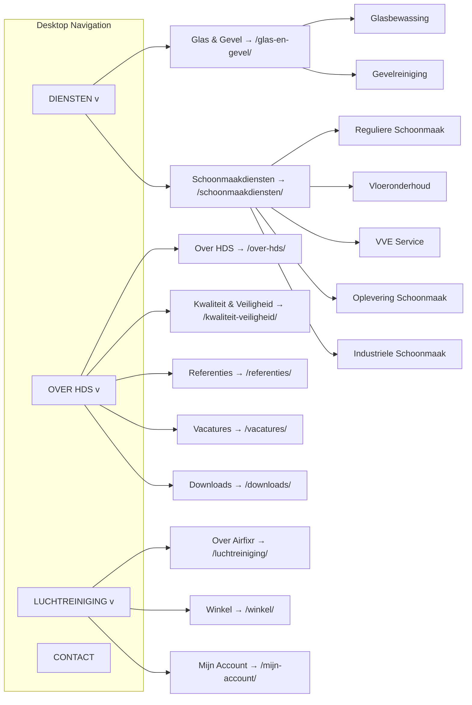

**Behaviour:**
- **Desktop:** Dropdown opens on `:hover` (300ms delay to prevent accidental triggers). Closes on mouse-out. Parent items are clickable (navigate to landing pages). Dropdown has `--hds-shadow-lg`.
- **Mobile:** Hamburger icon toggles full-screen overlay or slide-in panel. Parent items with children show expand/collapse arrows. Tap parent → children accordion open (without navigating). Tap parent again → collapse. Tap child → navigate; menu closes. Touch targets ≥ 44px.
- **Active state:** Current page or ancestor highlighted (`.current-menu-item` or `.current-page-ancestor`). Primary color for active item.

**Keyboard:**
- Tab: Move focus through menu items.
- Enter/Space: Activate focused link or toggle dropdown.
- Escape: Close open dropdown; focus returns to parent trigger.
- Arrow keys: Navigate within dropdown (up/down).

**Accessibility:**
- `<nav role="navigation" aria-label="Hoofdmenu">`
- Hamburger: `aria-controls="primary-menu"`, `aria-expanded="true/false"`.
- Dropdown toggle: `aria-haspopup="true"`, `aria-expanded="true/false"`.

### 7.3 Hero Section

**Purpose:** Page introduction. Communicates primary message and CTA.

**Variants:**
- **Homepage Hero:** Full-width. H1 = tagline "Helder en Duidelijk voor het Schoonste resultaat!". Subtitle = USP summary. CTA button = "Vrijblijvende offerte". Background: solid primary-light with subtle gradient or client-provided hero image with dark overlay.
- **Service Hero:** Breadcrumbs + H1 + subtitle (from custom field) + CTA button. Background: optional hero image from custom field. Falls back to light-gray background.
- **Category Landing Hero:** H1 + intro paragraph. Background: light-gray.
- **About Hero:** H1 + optional subtitle. Background: light-gray.

**Structure:**
```
┌─────────────────────────────────────────────┐
│  [Breadcrumbs (inner pages only)]            │
│                                              │
│  H1: Page Heading                            │
│  Subtitle / Intro paragraph (optional)       │
│                                              │
│  [CTA Button (if applicable)]                │
│                                              │
└─────────────────────────────────────────────┘
```

**Properties:**
- Padding: `--hds-space-20` (desktop), `--hds-space-12` (mobile).
- Text alignment: center (homepage, service), left (about, category landing).
- CTA button: `is-style-cta` variant (larger, accent color).

**Responsive:**
- Mobile: Stack vertically. H1 reduces size. CTA full-width.

### 7.4 CTA Banner

**Purpose:** Mid-page or bottom-of-page call-to-action section. "Wilt u een vrijblijvende offerte?"

**Structure:**
```
┌─────────────────────────────────────────────┐
│  H2: Wilt u een vrijblijvende offerte?       │
│     Wij denken graag met u mee.              │
│                                              │
│  [Vrijblijvende offerte aanvragen]  (button) │
└─────────────────────────────────────────────┘
```

**Properties:**
- Background: `--hds-color-primary`.
- Text color: `--hds-color-white`.
- Button: white background, primary text (inverted from default).
- Padding: `--hds-space-12` (both axes).
- Full-width (edge-to-edge).
- Text alignment: center.

**Variants:**
- **Standard:** Blue background, white text, white outlined CTA button.
- **Accent:** Orange background for urgency (rare — marketing campaigns only).

### 7.5 Service Cards

**Purpose:** Display a single service with icon, title, description, and link.

**Structure:**
```
┌──────────────────┐
│   [Icon]          │
│                  │
│ H3: Service Name │
│ Short description │
│                  │
│ [Lees meer →]    │
└──────────────────┘
```

**States:**
- **Default:** White background. Border: 1px solid `--hds-color-border`. Border-radius: `--hds-radius-md`.
- **Hover:** Shadow: `--hds-shadow-md`. Subtle lift (`transform: translateY(-2px)`). Border color transitions to primary.
- **Focus:** Outline: 2px solid `--hds-color-primary`. Offset: 2px.

**Properties:**
- Padding: `--hds-space-6`.
- Icon: 48×48px (homepage), 40×40px (category landing). Primary color.
- Title: `--hds-text-xl`, semibold. Links to service page.
- Description: `--hds-text-sm`, `--hds-color-text-secondary`. 1–2 lines truncated.
- Link: "Lees meer" with arrow icon. Primary color. `--hds-font-semibold`.

**Responsive:**
- Mobile: Full width.
- Tablet: 2 columns.
- Desktop: 3 columns.

**Accessibility:**
- Entire card is wrapped in an `<article>` element.
- Icon has `aria-hidden="true"`.
- Link text includes service name for context ("Lees meer over Glasbewassing").

### 7.6 Testimonials

**Purpose:** Social proof through client quotes and ratings.

**Structure (Single Testimonial Card):**
```
┌──────────────────────────┐
│ "Quote text in italics..."│
│                          │
│ ★★★★☆ (4/5)            │
│                          │
│ — Author Name            │
│   Company Name           │
└──────────────────────────┘
```

**Properties:**
- Background: `--hds-color-light-gray` or white card.
- Quote: `--hds-text-lg`, italic, `--hds-color-text`.
- Stars: Gold color (`#f9a825`). Filled ★ for rating, outlined ☆ for remainder.
- Author: `--hds-font-semibold`. Company: `--hds-text-sm`, secondary color.
- Padding: `--hds-space-6`.
- Border-radius: `--hds-radius-md`.

**Layout:** 1–3 cards in a row depending on viewport.

**Empty State:** Section hidden entirely when no testimonials exist.

### 7.7 FAQ Accordion

**Purpose:** Display frequently asked questions with expandable answers.

**Structure (Single FAQ Item):**
```
▶ Wat zijn de kosten van reguliere schoonmaak?
  ────────────────────────────
  [collapsed]

▼ Wat zijn de kosten van reguliere schoonmaak?
  De kosten zijn afhankelijk van de grootte van uw pand, de
  frequentie van de schoonmaak, en de specifieke wensen...
  ────────────────────────────
  [expanded]
```

**Properties:**
- Question: `--hds-font-semibold`, clickable. Padding: `--hds-space-4`.
- Border-bottom between items.
- Expand/collapse icon: chevron ▶ (closed) / ▼ (open). Transitions: `transform 0.2s ease`.
- Answer: `--hds-text-base`. Padding: `--hds-space-2` `--hds-space-4` `--hds-space-4`. Animated: `max-height` transition.
- Hover: Question background changes to `--hds-color-primary-light`.

**Keyboard:**
- Tab: Focus moves between questions.
- Enter/Space: Toggle current question.
- Implemented as `<button>` with `aria-expanded`.

**Accessibility:**
- Question: `<button aria-expanded="true/false">`.
- Answer: `<div role="region" aria-labelledby="faq-q-{id}">`.

### 7.8 Footer

**Purpose:** Secondary navigation, company information, legal links. Present on every page.

**Desktop Layout (5 columns):**
```
┌──────────┬──────────┬──────────┬────────────────┬──────────┐
│ DIENSTEN │ OVER HDS │ CONTACT  │ LUCHTREINIGING │JURIDISCH │
│          │          │          │                │          │
│ Glasbew. │ Over HDS │ 0164-... │ Over Airfixr   │ Privacy  │
│ Gevelr.  │ Kwaliteit│ info@... │ Winkel         │ Cookies  │
│ Regulier │ Referent.│ Adres    │ Mijn Account   │ Voorw.   │
│ Vloer    │ Vacatures│ KVK      │                │ Disclaim.│
│ VVE      │ Downloads│ BTW      │                │          │
│ Oplever. │          │          │                │          │
│ Industr. │          │          │                │          │
└──────────┴──────────┴──────────┴────────────────┴──────────┘
─────────────────────────────────────────────────────────────
  © 2026 HDS Onderhoudsdiensten    [FB] [IG]    Cookie-inst.
─────────────────────────────────────────────────────────────
```

**Properties:**
- Background: `--hds-color-dark-gray`.
- Text color: `--hds-color-white` (headings, copyright), `--hds-color-light-gray` (links, body).
- Heading: `--hds-text-lg`, `--hds-font-semibold`, white. Margin-bottom: `--hds-space-4`.
- Links: `--hds-text-sm`. Light gray, white on hover. No underline by default; underline on hover/focus.
- NAP (Name, Address, Phone): Sourced from Customizer. Conditional — hidden if fields empty.
- Social icons: 24×24px, white circles. Margin: `--hds-space-2` gap.
- Copyright: `--hds-text-xs`. Year auto-updated via PHP `gmdate('Y')`.
- Divider: `1px solid rgba(255,255,255,0.1)` between footer body and bottom bar.
- Padding: `--hds-space-12` top/bottom, reduced on mobile.

**Mobile:** Columns stack single-column. Bottom bar stacks vertically (copyright, social, cookie settings).

### 7.9 Breadcrumbs

**Purpose:** Show page location within site hierarchy. Improve navigation and SEO.

**Structure:**
```
Home > Diensten > Glasbewassing
```

**Properties:**
- Separator: `>` or `/` (chevron preferred).
- Font: `--hds-text-sm`, `--hds-color-gray`.
- Current page: `--hds-color-text`, not linked.
- Parent pages: links in gray, primary color on hover.
- Padding: `--hds-space-4` top/bottom.
- Visible on all inner pages. NOT on homepage.

**Accessibility:**
- Wrapped in `<nav aria-label="Kruimelpad">`.
- Uses `<ol>` with Schema.org `BreadcrumbList` microdata.
- Current page marked with `aria-current="page"`.

### 7.10 Buttons

**Variants:**

| Variant | Class | Usage |
|---|---|---|
| Primary | `.btn--primary` / `is-style-primary` | Standard actions: "Lees meer", "Verstuur bericht" |
| Secondary | `.btn--secondary` / `is-style-secondary` | Less prominent actions: "Terug", "Annuleren" |
| CTA | `.btn--cta` / `is-style-cta` | High-emphasis conversion: "Vrijblijvende offerte" |
| Text | `.btn--text` | Minimal actions: "Cookie-instellingen" |

**Sizes:**

| Size | Class | Usage |
|---|---|---|
| Small | `.btn--sm` | Compact UIs: table actions, filter tags |
| Medium | `.btn--md` (default) | Standard buttons |
| Large | `.btn--lg` | CTA banners, hero sections |

**States:**
- **Default:** Background color set. Cursor: pointer.
- **Hover:** Darker background (10% darker). Subtle scale (1.02) on CTA buttons.
- **Focus:** Outline: `2px solid var(--hds-color-primary)`. Outline-offset: `2px`. Visible focus ring.
- **Active:** Slightly darker. Scale: 0.98 (press feedback).
- **Disabled:** Opacity: 0.5. Cursor: not-allowed. No hover effects.
- **Loading:** Text changes to action + "...". Spinner icon (rotating). Button disabled.

**Accessibility:**
- Always use `<button>` or `<a>` with appropriate role.
- Loading state: `aria-busy="true"`.
- Disabled: `disabled` attribute (for `<button>`) or `aria-disabled="true"` (for `<a>`).

### 7.11 Forms

**Purpose:** Capture user input. Used for Contact, Quote Request, and Vacancy Application forms.

**Form Layout:**
```
┌──────────────────────────────────┐
│ Naam *                           │
│ ┌──────────────────────────────┐ │
│ │ Uw naam...                    │ │
│ └──────────────────────────────┘ │
│                                  │
│ E-mailadres *                    │
│ ┌──────────────────────────────┐ │
│ │ uw@email.nl                   │ │
│ └──────────────────────────────┘ │
│ ⚠ Vul een geldig e-mailadres in.│ ← error state
│                                  │
│ ☐ Ik ga akkoord met de          │
│   privacyverklaring *            │
│                                  │
│ ┌──────────────────────────────┐ │
│ │     Verstuur bericht          │ │
│ └──────────────────────────────┘ │
└──────────────────────────────────┘
```

**Field States:**
- **Default:** Border: `1px solid --hds-color-border`. Background: white.
- **Hover:** Border: `1px solid --hds-color-gray`.
- **Focus:** Border: `2px solid --hds-color-primary`. Outline: none (border replaces it). Box-shadow: `0 0 0 3px rgba(26,115,232,0.15)`.
- **Error:** Border: `2px solid --hds-color-error`. Error message below field in red.
- **Disabled:** Background: `--hds-color-light-gray`. Cursor: not-allowed. Opacity: 0.6.

**Labels:**
- Displayed above field. `--hds-label-font-size`. `--hds-font-semibold`.
- Required indicator: red asterisk (*) after label text. Also `aria-required="true"`.
- Optional fields: "(optioneel)" in gray after label.

**Checkboxes & Radios:**
- Custom styled (hidden native input, styled pseudo-element).
- 20×20px click area. Checked state: primary color fill + white checkmark.
- Label: inline, clickable (toggles checkbox).

**Accessibility:**
- All fields have `<label>` associated via `for`/`id`.
- Error messages linked via `aria-describedby="field-id-error"`.
- First field with error receives focus on validation failure.
- reCAPTCHA badge positioned so it's not obscured by other elements.

### 7.12 Cards

**Purpose:** Container for grouped content — services, testimonials, blog posts, downloads, vacancies.

**Base Card:**
```css
.hds-card {
  background: var(--hds-card-bg);
  border: var(--hds-card-border);
  border-radius: var(--hds-card-radius);
  padding: var(--hds-card-padding);
  box-shadow: var(--hds-card-shadow);
}
.hds-card:hover {
  box-shadow: var(--hds-card-hover-shadow);
  transform: translateY(-2px);
}
```

**Card Variants:**

| Variant | Class | Usage |
|---|---|---|
| Default | `.hds-card` | Service cards, blog post cards |
| Featured | `.hds-card--featured` | Primary service, highlighted item. Left border in primary color. |
| Compact | `.hds-card--compact` | Download cards, small lists. Reduced padding. |
| Flat | `.hds-card--flat` | No shadow, border only. Used in grids with background. |
| Interactive | `.hds-card--interactive` | Entire card is clickable. Hover lift + shadow. |

**Card Content Structure:**
```
┌──────────────────────────┐
│ [Image / Icon]           │  ← optional
│                          │
│ Title (H3)               │
│ Description text...      │
│                          │
│ [Action / Link]          │  ← optional
└──────────────────────────┘
```

### 7.13 Gallery / Image Display

**Purpose:** Display project photos, before/after comparisons.

**Not implemented at launch.** Gallery functionality deferred to Sprint 5 (media optimization) or post-launch. Default WordPress gallery block is sufficient for MVP.

**Assumption:** Client provides project photos (MI-09) before gallery can be populated.

### 7.14 Tables

**Purpose:** Display structured data (e.g., service comparisons, specifications, pricing).

**Style:**
```css
.hds-table {
  width: 100%;
  border-collapse: collapse;
}
.hds-table th {
  background: var(--hds-table-header-bg);
  font-weight: var(--hds-table-header-font-weight);
  text-align: left;
  padding: var(--hds-table-cell-padding);
  border-bottom: 2px solid var(--hds-color-border);
}
.hds-table td {
  padding: var(--hds-table-cell-padding);
  border-bottom: var(--hds-table-border);
}
.hds-table--striped tr:nth-child(even) td {
  background: var(--hds-table-stripe-bg);
}
```

**Responsive:** Tables with > 3 columns wrap on mobile (horizontal scroll container or stacked card layout).

**Accessibility:** Use `<caption>` for table title. Use `<thead>`, `<tbody>`. Scope attributes on header cells.

### 7.15 Search

**Form Appearance:**
```
┌──────────────────────────────┐  ┌────────┐
│ Zoeken...                    │  │ Zoeken │
└──────────────────────────────┘  └────────┘
```

**Properties:**
- Input: `--hds-input-*` tokens. Border-radius: `--hds-radius-pill` (pill shape).
- Button: Adjacent or overlay (magnifying glass icon).
- Width: 100% (mobile), 300px (desktop).
- Placeholder: "Zoeken..." in Dutch.

**Locations:**
- 404 page (prominent, centered, larger).
- Search results page (above results, if query empty or no results).
- Optionally in footer (replaces current site's search bar).

### 7.16 Filters

**Purpose:** Not implemented at launch. Deferred to blog (Sprint 5) — category/tag filtering.

### 7.17 Pagination

**Style:**
```
← Vorige  1  2  3  4  Volgende →
```

**Properties:**
- Current page: primary color background, white text, no border.
- Other pages: white background, gray border, primary text.
- Hover: light primary background.
- Disabled (first/last page): gray text, no hover.
- Arrows: « » or ← →.
- Spacing: `--hds-space-2` between page numbers.
- Alignment: center.

### 7.18 Cookie Consent Banner

**Provided by:** Complianz Premium plugin. Styled to match HDS design tokens.

**Appearance:**
```
┌──────────────────────────────────────────────────────────┐
│ 🍪 Deze website gebruikt cookies                          │
│                                                          │
│ Wij gebruiken functionele cookies voor de werking van de  │
│ website. Analytische en marketing cookies plaatsen wij    │
│ alleen met uw toestemming. Lees ons cookiebeleid.        │
│                                                          │
│ [Instellingen aanpassen]  [Weigeren]  [Accepteren]       │
└──────────────────────────────────────────────────────────┘
```

**Properties:**
- Position: Bottom of screen (banner) or centered (modal on "Instellingen aanpassen").
- Background: white. Shadow: `--hds-shadow-lg`.
- Border-radius: `--hds-radius-md`.
- Buttons: "Accepteren" = primary (filled). "Weigeren" = secondary (outline). "Instellingen aanpassen" = text link.
- Overlay (modal): semi-transparent dark background behind modal.

**Customization:** Complianz allows CSS customization. Override default styles to match `--hds-*` tokens.

### 7.19 Notification / Alert

**Purpose:** Display success, error, warning, or info messages to the user.

**Variants:**

| Type | Class | Icon | Colors |
|---|---|---|---|
| Info | `.hds-alert--info` | ℹ | `--hds-alert-info-bg` / `--hds-alert-info-border` |
| Success | `.hds-alert--success` | ✓ | `--hds-alert-success-bg` / `--hds-alert-success-border` |
| Warning | `.hds-alert--warning` | ⚠ | `--hds-alert-warning-bg` / `--hds-alert-warning-border` |
| Error | `.hds-alert--error` | ✕ | `--hds-alert-error-bg` / `--hds-alert-error-border` |

**Usage:**
- Form submission success (redirects to Bedankt page — no inline alert needed).
- WooCommerce add-to-cart confirmation (handled by WC notices).
- Cookie consent status messages.
- Empty state messages (e.g., "Geen resultaten gevonden").

### 7.20 404 Page

**Layout:**
```
┌──────────────────────────────────────────────┐
│                                              │
│         Pagina niet gevonden                  │
│                                              │
│  De pagina die u zoekt bestaat niet of is     │
│  verplaatst.                                  │
│                                              │
│  ┌────────────────────────────┐  ┌────────┐  │
│  │ Zoeken...                  │  │ Zoeken │  │
│  └────────────────────────────┘  └────────┘  │
│                                              │
│  Mogelijk bent u op zoek naar:               │
│  • Home                                      │
│  • Schoonmaakdiensten                        │
│  • Contact                                   │
│  • Offerte Aanvragen                          │
│                                              │
│  Of neem direct contact op:                  │
│  📞 0164-652846                              │
│  ✉ info@helderduidelijkschoon.nl             │
│                                              │
└──────────────────────────────────────────────┘
```

**Properties:**
- Centered. Maximum width: 600px.
- H1: `--hds-text-4xl`.
- Search bar: prominent, wider than default.
- Links: bulleted list. Primary color.
- Contact info: at bottom, with icons.

### 7.21 Loading State

**Form Submit Loading:**
```
┌──────────────────────────────────┐
│     ⟳ Versturen...               │ ← spinner icon + text change
└──────────────────────────────────┘
```

- Button text changes to action + "..." (e.g., "Versturen...", "Offerte aanvragen...").
- Spinner icon: CSS animation (rotate 360°).
- Button: `aria-busy="true"`, disabled.
- Gravity Forms AJAX submission provides this natively.

**Page Load (Skeleton):**
- Not implemented at launch. Pages load fast enough that skeleton screens are unnecessary.
- If needed post-launch: gray placeholder blocks that animate (pulse) until content loads.

### 7.22 Empty State

**Purpose:** Gracefully handle sections or pages with no content.

| Empty State | Message | Action |
|---|---|---|
| No testimonials | "Wij horen graag uw ervaring! Deel uw review." | Section hidden on homepage; message on Referenties page |
| No client logos | — | Section hidden entirely |
| No blog posts | "Binnenkort verschijnen hier de eerste artikelen." | Link to Contact page |
| No vacancies | "Er zijn momenteel geen openstaande vacatures." | None |
| No search results | "Geen resultaten gevonden. Probeer een andere zoekterm." | Search form re-displayed |
| No FAQ items | "Binnenkort vindt u hier antwoorden op veelgestelde vragen." | Link to Contact page |

**Visual Style:**
- Centered. Light icon (64×64px, gray) above text.
- Text: `--hds-text-lg`, `--hds-color-text-secondary`.
- Optional CTA button below message.

### 7.23 Error State

**Form Validation Errors (Inline):**
- Red border on field (`--hds-input-error-border`).
- Red error text below field (`--hds-input-error-color`).
- Error icon (⚠) before text.
- Field receives focus on validation.
- Error linked to field via `aria-describedby`.

**Server Error (Generic):**
```
┌──────────────────────────────────────────┐
│ ⚠ Er is een fout opgetreden              │
│                                          │
│ Probeer het opnieuw of neem telefonisch  │
│ contact op via 0164-652846.              │
└──────────────────────────────────────────┘
```

---

## 8. Page Templates

### 8.1 Homepage

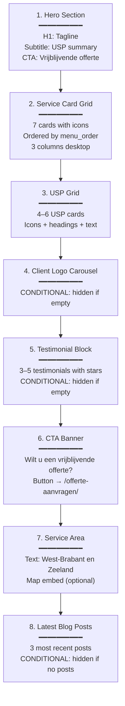

**Sections that alternate background:** Service Grid (white) → USP Grid (light-gray) → Logos (white) → Testimonials (light-gray) → CTA Banner (primary blue) → Service Area (white) → Blog Posts (light-gray).

### 8.2 Service Page (Single Service)

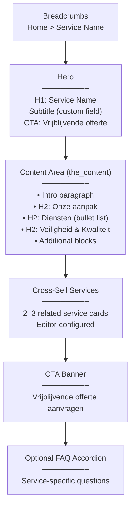

### 8.3 Category Landing Page

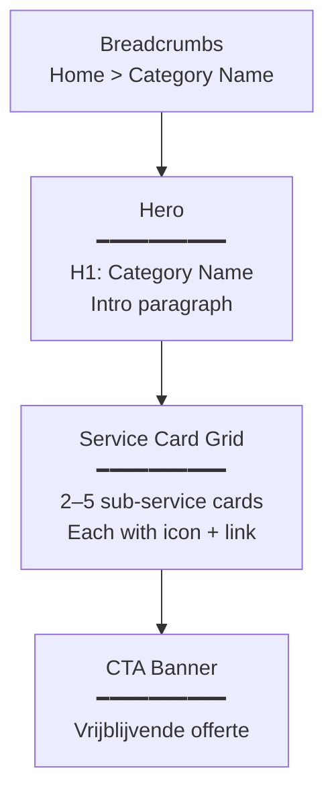

### 8.4 Contact Page

**Desktop Layout (Two-Column):**
```
┌────────────────────────────┬──────────────────┐
│  Breadcrumbs               │                  │
│  H1: Contact               │                  │
│                            │                  │
│  Contact Form (GF-1)      │  Contact Info     │
│  ┌──────────────────────┐  │  ────────────    │
│  │ Naam *               │  │  📞 0164-652846  │
│  │ ┌──────────────────┐ │  │  ✉ info@...      │
│  │ │                  │ │  │                  │
│  │ └──────────────────┘ │  │  📍 Adres         │
│  │                      │  │  (if provided)    │
│  │ Bedrijf              │  │                  │
│  │ ┌──────────────────┐ │  │  KVK: XXXXXXXX    │
│  │ │                  │ │  │  (if provided)    │
│  │ └──────────────────┘ │  │  BTW: NL...       │
│  │ ...                  │  │  (if provided)    │
│  │                      │  │                  │
│  │ ☐ Privacy akkoord *  │  │  🕐 Openingstijden│
│  │                      │  │  (if provided)    │
│  │ [Verstuur bericht]   │  │                  │
│  └──────────────────────┘  │  [FB] [IG]        │
│                            │                  │
└────────────────────────────┴──────────────────┘
```

**Mobile:** Single column. Form first, contact info below.

### 8.5 Offerte Aanvragen Page

**Layout:** Full-width form (no sidebar). Same two-column approach as Contact but form is primary focus.

```
┌──────────────────────────────────────────────┐
│  Breadcrumbs                                 │
│  H1: Offerte Aanvragen                       │
│                                              │
│  Intro text (the_content)                    │
│                                              │
│  Quote Form (GF-2) — full width              │
│  ┌──────────────────────────────────────────┐│
│  │ Naam *         │ Bedrijf *               ││
│  │ ┌────────────┐ │ ┌──────────────────────┐││
│  │ └────────────┘ │ └──────────────────────┘││
│  │                                          ││
│  │ E-mailadres *  │ Telefoonnummer *        ││
│  │ ┌────────────┐ │ ┌──────────────────────┐││
│  │ └────────────┘ │ └──────────────────────┘││
│  │                                          ││
│  │ Gewenste dienst * (checkboxes)           ││
│  │ ☐ Glasbewassing  ☐ Gevelreiniging        ││
│  │ ☐ Reguliere Schoonmaak  ☐ Vloeronderhoud  ││
│  │ ☐ VVE Service  ☐ Oplevering  ☐ Industrieel││
│  │ ☐ Anders                                ││
│  │ ...                                      ││
│  │                                          ││
│  │ [Offerte aanvragen]                      ││
│  └──────────────────────────────────────────┘│
└──────────────────────────────────────────────┘
```

### 8.6 About Page

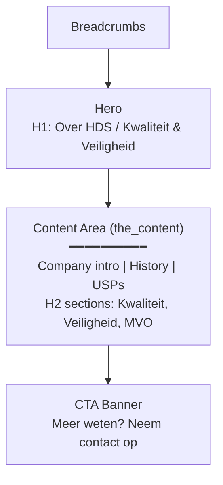

### 8.7 Vacatures Page

```
┌──────────────────────────────────────────────┐
│  Breadcrumbs: Home > Vacatures               │
│  H1: Vacatures                               │
│  Subtitle: Wordt u onze collega?             │
│                                              │
│  Employer intro paragraph                    │
│                                              │
│  ┌──────────────────────────────────────────┐│
│  │ Vacature Card 1                          ││
│  │ ────────────────────────────────────     ││
│  │ H3: Glas- en Gevelreiniger              ││
│  │ Uren: 32–40 uur/week                    ││
│  │ Locatie: Bergen op Zoom                 ││
│  │ Sluitingsdatum: 31-12-2026              ││
│  │ [▼ Bekijk vacature] (toggle expand)     ││
│  │   ┌─────────────────────────────────┐   ││
│  │   │ Full description...             │   ││
│  │   │                                 │   ││
│  │   │ [Solliciteer nu] (mailto:)      │   ││
│  │   └─────────────────────────────────┘   ││
│  └──────────────────────────────────────────┘│
│                                              │
│  ┌──────────────────────────────────────────┐│
│  │ Vacature Card 2                          ││
│  │ ...                                      ││
│  └──────────────────────────────────────────┘│
└──────────────────────────────────────────────┘
```

### 8.8 Legal Page

```
┌──────────────────────────────────────────────┐
│  Breadcrumbs: Home > Privacyverklaring       │
│                                              │
│  H1: Privacyverklaring                       │
│                                              │
│  Content (rich text)                         │
│  • Data controller                           │
│  • Processing purposes                       │
│  • Legal basis                               │
│  • Retention periods                         │
│  • Data subject rights                       │
│  • Third-party sharing                       │
│  • Contact details                           │
│                                              │
│  Laatst bijgewerkt: 1 juli 2026              │
└──────────────────────────────────────────────┘
```

### 8.9 Blog Index (Kennisbank)

```
┌──────────────────────────────────────────────┐
│  H1: Kennisbank                              │
│                                              │
│  ┌────────┐ ┌────────┐ ┌────────┐           │
│  │[Image] │ │[Image] │ │[Image] │           │
│  │        │ │        │ │        │           │
│  │Title   │ │Title   │ │Title   │           │
│  │Date    │ │Date    │ │Date    │           │
│  │Excerpt │ │Excerpt │ │Excerpt │           │
│  │Lees    │ │Lees    │ │Lees    │           │
│  │meer →  │ │meer →  │ │meer →  │           │
│  └────────┘ └────────┘ └────────┘           │
│                                              │
│         ← Vorige  1  2  3  Volgende →       │
└──────────────────────────────────────────────┘
```

### 8.10 Single Blog Post

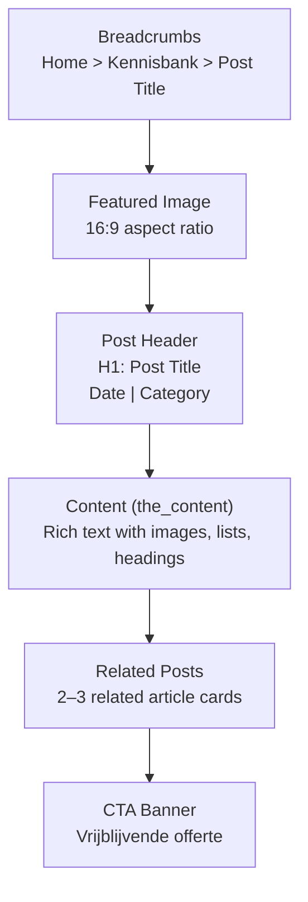

### 8.11 WooCommerce Pages

**Shop (`/winkel/`):**
```
┌──────────────────────────────────────────────┐
│  H1: Winkel                                  │
│  Intro paragraph (Airfixr explanation)       │
│                                              │
│  ┌────────┐ ┌────────┐ ┌────────┐           │
│  │[Image] │ │[Image] │ │[Image] │           │
│  │Product │ │Product │ │Product │           │
│  │€ 325,00│ │€ 595,00│ │€ 795,00│           │
│  │excl.BTW│ │excl.BTW│ │excl.BTW│           │
│  │[In mand│ │[In mand│ │[In mand│           │
│  └────────┘ └────────┘ └────────┘           │
│                                              │
│         ← Vorige  1  2  Volgende →          │
└──────────────────────────────────────────────┘
```

**Single Product:**
```
┌───────────────────┬──────────────────────────┐
│                   │ H1: Airfixr 60            │
│   [Product        │                          │
│    Image]         │ € 325,00 excl. BTW       │
│                   │                          │
│   [Gallery        │ Description...           │
│    thumbnails]    │ Specifications...         │
│                   │                          │
│                   │ Aantal: [-] 1 [+]         │
│                   │                          │
│                   │ [In winkelmand]          │
└───────────────────┴──────────────────────────┘
```

**Cart + Checkout:** Standard WooCommerce templates with HDS header/footer wrapping. No custom cart/checkout templates needed at launch.

---

## 9. User Experience Rules

### 9.1 Scrolling

- Smooth scrolling enabled (`scroll-behavior: smooth`).
- Sticky header appears on scroll-up; hides on scroll-down (optional — can be always-visible).
- Back-to-top button: floating circle at bottom-right. Appears after 300px scroll. Primary color. Arrow icon.

### 9.2 Animations & Transitions

| Element | Animation |
|---|---|
| Button hover | `background-color 0.15s ease` |
| Card hover | `box-shadow 0.2s ease, transform 0.2s ease` |
| Dropdown open | `opacity 0.2s ease, transform 0.2s ease` (fade + slide) |
| FAQ accordion | `max-height 0.3s ease` |
| Mobile menu | `transform 0.3s ease` (slide in from right) |
| Form focus | `border-color 0.15s ease, box-shadow 0.15s ease` |

**Reduced Motion:** All animations wrapped in `@media (prefers-reduced-motion: no-preference)`.

### 9.3 Hover States

- Links: Color transitions from `--hds-color-text` to `--hds-color-primary`.
- Buttons: Background darkens 10%. Subtle scale (1.02) on CTA buttons.
- Cards: Shadow increases. Subtle lift (`translateY(-2px)`).
- Navigation items: Background becomes `--hds-color-primary-light`.
- Table rows: Background becomes `--hds-table-stripe-bg`.
- No hover states on touch devices (use `@media (hover: hover)`).

### 9.4 Focus States

**Implementation:**
```css
*:focus-visible {
  outline: 2px solid var(--hds-color-primary);
  outline-offset: 2px;
}

/* Remove default outline for mouse users; keep for keyboard */
*:focus:not(:focus-visible) {
  outline: none;
}
```

**Rules:**
- Every interactive element has a visible focus indicator.
- Focus indicator is 2px solid primary color, offset 2px from element.
- Skip-to-content link: hidden until focused, then visible at top-left.
- Focus order follows DOM order (logical tab sequence).
- No `outline: none` without a replacement indicator.

### 9.5 Keyboard Navigation

- **Tab:** Forward through interactive elements.
- **Shift+Tab:** Backward.
- **Enter/Space:** Activate focused element.
- **Escape:** Close modals, dropdowns, mobile menu. Return focus to trigger.
- **Arrow Keys (Up/Down):** Navigate within dropdowns, select options.
- **Home/End:** Jump to first/last item in navigation.

### 9.6 Form Interactions

- **Click label:** Focuses associated input.
- **Tab:** Moves between fields in logical order (top-to-bottom, left-to-right).
- **Enter in single-line field:** Submits form (if not inside textarea).
- **Validation on blur:** Field validates when user leaves it (optional — can validate on submit only).
- **Submit:** Button shows loading state. All fields validated. Errors displayed inline. Focus moves to first error.

### 9.7 Validation

- **Required fields:** Cannot be empty. "Dit veld is verplicht."
- **Email:** Must match email pattern. "Vul een geldig e-mailadres in."
- **Postcode (GF-2):** Must match Dutch format `1234 AB`. "Vul een geldige postcode in (bijv. 1234 AB)."
- **Message (GF-1):** Min 10 characters. "Uw bericht moet minimaal 10 tekens bevatten."
- **Privacy checkbox:** Must be checked. "U moet akkoord gaan met de privacyverklaring."
- **File upload:** Max 5MB. Allowed types: PDF, JPG, PNG, DOCX. "Het bestand is te groot / type niet toegestaan."

### 9.8 Feedback

- **Form submission success:** Redirect to `/bedankt/?type={form}`. No inline success message.
- **WooCommerce add-to-cart:** WC notice bar at top of page. "Airfixr 60 is toegevoegd aan uw winkelmand." with link to cart.
- **Cookie consent:** Banner disappears. No inline confirmation (consent recorded in background).
- **Search with results:** Heading: "Zoekresultaten voor: [query]". Count of results. List below.
- **Search with no results:** "Geen resultaten gevonden." + search form.

---

## 10. Accessibility

### 10.1 WCAG 2.2 AA Compliance

All 20 HDS accessibility requirements (REQ-ACC-001..020) are designed into the UI from the start, not retrofitted. See NFR §8 for the full compliance matrix.

**Key Design-Level Measures:**

| # | Requirement | Design Implementation |
|---|---|---|
| A01 | Color contrast ≥ 4.5:1 | All text/background combinations checked against `--hds-color-*` palette. Primary blue (#1a73e8) on white: 4.54:1 (pass). Dark gray (#333) on white: 11.2:1 (pass). Gray (#757575) on white: 4.6:1 (pass). |
| A02 | Keyboard operability | All interactive elements are native HTML (`<a>`, `<button>`, `<input>`, `<select>`) or have explicit keyboard handlers. |
| A03 | Skip-to-content link | First focusable element in `<header>`. Hidden off-screen until focused. |
| A04 | Semantic heading hierarchy | H1 → H2 → H3. No skipped levels. Block Editor enforces this via block types. |
| A05 | ARIA landmarks | `<header role="banner">`, `<nav role="navigation">`, `<main id="main">`, `<footer role="contentinfo">`. `<section>` elements with `aria-labelledby`. |
| A06 | Alt text on images | Required in Media Library for all non-decorative images. Decorative images: `alt=""`. |
| A07 | Form labels + errors | All inputs have `<label>`. Required fields: `aria-required="true"`. Errors: `aria-describedby`. |
| A08 | Descriptive links | No "klik hier" or "lees meer" without context. Screen-reader text provides context where visual text is insufficient. |
| A09 | 200% zoom | Responsive layout (no fixed widths) ensures no horizontal scroll at 200% zoom. |
| A10 | Touch targets ≥ 44px | All navigation items, buttons, form controls, and icons meet this minimum. |
| A11 | `lang="nl-NL"` | Set on `<html>` via `language_attributes()`. |
| A12 | Reduced motion | CSS animations wrapped in `@media (prefers-reduced-motion: no-preference)`. |

### 10.2 Screen Reader Testing

**Test Scenarios (NVDA / VoiceOver):**
1. Navigate homepage — headings, service cards, and CTAs announced correctly.
2. Navigate service page — breadcrumbs, hero, and content sections announced.
3. Complete Contact form — labels read; required fields announced; errors read after validation; success redirect announced.
4. Navigate mobile menu — expanded/collapsed state announced.
5. Cookie banner — options announced; selection confirmed.

### 10.3 Focus Management

- **Page load:** Focus on `<body>` or skip-to-content link (if user tabs).
- **Modal open (cookie settings, mobile menu):** Focus moves to first focusable element inside. Focus trapped inside until closed.
- **Modal close:** Focus returns to the element that triggered the modal.
- **Form validation failure:** Focus moves to first field with error.
- **Dynamic content (cart update, search results):** `aria-live="polite"` region announces changes.

### 10.4 Accessible Forms Checklist

- [ ] Every input has a `<label>` with matching `for`/`id`.
- [ ] Required fields marked with asterisk + `aria-required="true"`.
- [ ] Error messages linked via `aria-describedby`.
- [ ] First error receives focus on validation failure.
- [ ] Submit button has loading state with `aria-busy="true"`.
- [ ] reCAPTCHA badge not obscured by other elements.
- [ ] Form can be completed using keyboard only.
- [ ] Form can be completed using screen reader.

---

## 11. Mobile UX

### 11.1 Touch Targets

- Minimum size: **44×44px** (WCAG 2.5.8 AAA, adopted as AA for this project).
- Navigation links: 44px minimum height. Sufficient padding ensures touch area.
- Form submit buttons: at least 48px height on mobile.
- Checkbox/radio labels: entire label row is clickable (not just the 20px box).
- Card links: entire card is tappable (not just the "Lees meer" text).

### 11.2 Sticky CTA

- **Phone number in header:** Always visible. On mobile, icon-only with `tel:` link. Tap to call.
- **CTA on service pages:** "Vrijblijvende offerte" button at top (hero) and bottom (CTA banner). Both visible without excessive scrolling.
- **No floating sticky CTA bar:** Avoids obscuring content. Phone in header is sufficient.

### 11.3 Responsive Navigation

- **Closed:** Hamburger icon (☰) at top-right. `aria-expanded="false"`.
- **Open:** Full-screen overlay or slide-in from right. Logo + close icon (✕) at top. Menu items listed vertically with generous spacing.
- **Parent items:** Chevron (▶) icon. Tap to expand children (accordion). Tap again to collapse. Children indented.
- **Close:** Tap ✕ icon, tap overlay background, or press Escape.
- **After navigation:** Menu closes automatically when a link is tapped.

### 11.4 Performance Considerations for Mobile

- Total page weight < 1.5 MB.
- Images: WebP with responsive `srcset`. Lazy-loaded below fold.
- Fonts: Self-hosted, subset to Latin + Dutch diacritics. `font-display: swap` prevents invisible text during load.
- JavaScript: Minimal. `defer` attribute. Vanilla JS (no jQuery for theme code).
- Critical CSS: Inlined in `<head>`. Above-fold content renders immediately.
- No large hero videos. No auto-playing media.

---

## 12. Conversion Optimization

### 12.1 Primary CTA

- **Text:** "Vrijblijvende offerte" (no-obligation quote). Emphasizes the "no obligation" aspect.
- **Placement:** Hero section (top) and CTA banner (bottom) of every service page. Homepage hero. Category landing pages.
- **Appearance:** `is-style-cta` button variant. Accent orange (`--hds-color-accent`) for high visibility. Larger than standard buttons.
- **Link:** Always `/offerte-aanvragen/`. Never `/contact/` (service pages should drive to the higher-intent quote form).

### 12.2 Secondary CTA

- **Text:** "Neem contact op" or "Bel ons: 0164-652846".
- **Placement:** Header (always visible). Contact page sidebar. Footer.
- **Appearance:** Phone icon + number. Primary color. `tel:` link.

### 12.3 Trust Signals

| Signal | Placement |
|---|---|
| KVK-nummer | Footer (conditional) |
| BTW-nummer | Footer (conditional) |
| OSB membership | Kwaliteit & Veiligheid page; Homepage (if logo available) |
| VvE Belang listing | VVE Service page |
| Certifications (Arbo, diplomas) | Kwaliteit & Veiligheid page |
| Client logos | Homepage (carousel), Referenties page (grid) |
| Testimonials with star ratings | Homepage, Referenties page |
| "Vrijblijvend" (no obligation) language | All CTAs |
| "Binnen 1 werkdag" (response time) | Contact/Quote pages, Bedankt page |

### 12.4 Quote Request Flow Optimization

1. Every service page has a visible CTA → `/offerte-aanvragen/`.
2. Quote form pre-selects "Gewenste dienst" if the user arrived from a specific service page (via URL parameter `?dienst=glasbewassing`).
3. Form is focused: required fields marked clearly. Optional fields labeled "(optioneel)".
4. File upload supports common formats (PDF, JPG, PNG, DOCX) — facility managers often have site plans or photos.
5. Post-submit Bedankt page sets expectations: "Wij streven ernaar binnen 1 werkdag contact op te nemen."

---

## 13. SEO-Aware UI

### 13.1 Heading Hierarchy

Every page follows a strict H1 → H2 → H3 hierarchy:
- **H1:** Page title. Exactly once per page.
- **H2:** Major sections (Onze aanpak, Diensten, Veiligheid & Kwaliteit).
- **H3:** Sub-sections within H2.
- No heading level is ever skipped (no H1 → H3 without H2).

### 13.2 Internal Linking

- Service pages: Cross-sell section links to 2–3 related services (see FS §4.2 cross-link matrix).
- Blog posts: "Related Posts" section at bottom.
- Footer: Links to all major sections.
- Breadcrumbs: Every inner page.
- Navigation: All major sections accessible.

### 13.3 Breadcrumbs

Visible on all inner pages. Schema `BreadcrumbList` microdata. Flat structure: `Home > [Page Name]`.

### 13.4 Structured Data Locations

| Schema Type | UI Location | Technical Implementation |
|---|---|---|
| LocalBusiness | Home, Contact, Over HDS pages — in `<head>` as JSON-LD | `inc/schema.php` |
| Service | Each service page (P02–P08) — in `<head>` as JSON-LD | `inc/schema.php` |
| FAQPage | Veelgestelde Vragen (P18) | Rank Math auto from FAQ blocks |
| JobPosting | Per vacancy on Vacatures page (P14) | `inc/schema.php` |
| Product | Each WooCommerce product page | WooCommerce auto |
| BreadcrumbList | All inner pages | Rank Math + template part |
| Organization + sameAs | All pages | `inc/schema.php` |

### 13.5 Image Optimization

- Format: WebP primary, PNG/JPEG fallback via `<picture>`.
- Compression: Quality 85+.
- Dimensions: Explicit `width`/`height` attributes to prevent CLS.
- Lazy loading: `loading="lazy"` below fold.
- LCP image: `fetchpriority="high"`.

### 13.6 Alt Text Policy

- **Non-decorative images:** Descriptive alt text in Dutch. Describes what the image shows and its relevance to the content.
- **Decorative images:** `alt=""` (empty alt attribute). Screen readers skip them.
- **Service icons with text labels:** `aria-hidden="true"` on icon. Text label provides the information.
- **Client logos:** Alt text = company name.
- **Product images:** Alt text = product name.

---

## 14. Component Library

### 14.1 Component Index

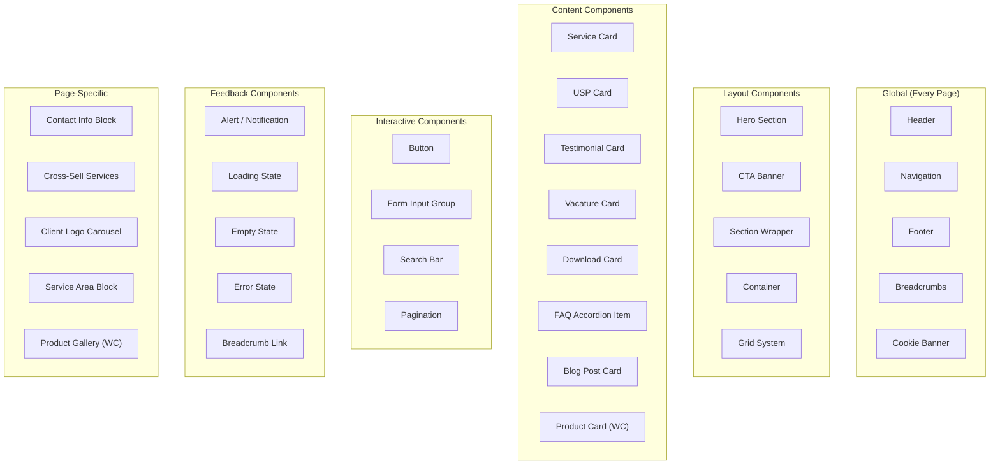

### 14.2 Component Specification Format

Each component below follows this specification format:
- **Purpose:** What the component does.
- **Properties:** CSS custom properties and design tokens used.
- **States:** Default, hover, focus, active, disabled, error, loading, empty.
- **Variants:** Alternative styles.
- **Accessibility:** ARIA roles, keyboard behavior, screen reader expectations.
- **Responsive:** How it behaves at each breakpoint.

### 14.3 Key Component Specifications

#### Button

| Attribute | Value |
|---|---|
| **Purpose** | Trigger an action or navigate to a URL |
| **Variants** | `primary`, `secondary`, `cta`, `text` |
| **Sizes** | `sm`, `md` (default), `lg` |
| **States** | default, hover, focus, active, disabled, loading |
| **Accessibility** | Native `<button>` or `<a>`. Loading: `aria-busy="true"`. Disabled: `disabled` attribute. |
| **Responsive** | Full-width on mobile when inside hero/CTA sections. Standard width otherwise. |

#### Service Card

| Attribute | Value |
|---|---|
| **Purpose** | Display a single service with brief info |
| **Properties** | `--hds-card-*` tokens |
| **States** | default, hover (lift + shadow), focus (ring) |
| **Variants** | `default`, `featured` (left border accent) |
| **Accessibility** | Wrapped in `<article>`. Icon `aria-hidden="true"`. Link text descriptive. Entire card clickable. |
| **Responsive** | 1 col mobile, 2 col tablet, 3 col desktop |

#### Form Input Group

| Attribute | Value |
|---|---|
| **Purpose** | Label + input + optional error message |
| **Properties** | `--hds-input-*`, `--hds-label-*` tokens |
| **States** | default, hover, focus, error, disabled |
| **Accessibility** | `<label for="id">`. `aria-required` on required. `aria-describedby` on error. Error linked to field. |
| **Responsive** | Full-width on all breakpoints |

#### Testimonial Card

| Attribute | Value |
|---|---|
| **Purpose** | Display a client testimonial with rating |
| **Properties** | `--hds-card-*` tokens. Gold star color. |
| **States** | default |
| **Variants** | `default` (white card), `minimal` (no card, just quote) |
| **Accessibility** | `<blockquote>`. Star rating has `aria-label="X van 5 sterren"`. Author in `<cite>`. |
| **Responsive** | 1 col (all breakpoints) or 2 col (desktop) in grid |

#### Vacature Card

| Attribute | Value |
|---|---|
| **Purpose** | Display a job vacancy with details |
| **Properties** | `--hds-card-*` tokens |
| **States** | default, expanded (shows full description) |
| **Variants** | `default` |
| **Accessibility** | Toggle button: `aria-expanded`. Description region: `aria-labelledby`. JobPosting schema in JSON-LD. |
| **Responsive** | Full-width. Stacked details on mobile. |

#### FAQ Accordion Item

| Attribute | Value |
|---|---|
| **Purpose** | Expandable question/answer pair |
| **Properties** | `--hds-space-*` for padding |
| **States** | collapsed (default), expanded, hover |
| **Accessibility** | Question: `<button aria-expanded="true/false">`. Answer: `<div role="region" aria-labelledby="faq-id">`. |
| **Responsive** | Full-width on all breakpoints |

#### Contact Info Block

| Attribute | Value |
|---|---|
| **Purpose** | Display company contact details |
| **Properties** | `--hds-card-*` tokens. Icon + text layout. |
| **States** | default |
| **Variants** | `sidebar` (Contact page), `footer` (compact) |
| **Accessibility** | Phone: `tel:` link. Email: `mailto:` link. Address in `<address>`. |
| **Responsive** | Full-width on mobile, sidebar on desktop Contact page |

---

## 15. Wireframe Recommendations

### 15.1 Homepage Wireframe

```mermaid
block-beta
    columns 12
    block:Header:12
        columns 4
        Logo:1 NavLinks:2 Phone:1
    end
    
    block:Hero:12
        H1["H1: Tagline"] :6
        space
        Subtitle:6
        CTAButton["CTA Button"] :4
    end
    
    block:ServiceGrid:12
        Card1["Card 1"]:4
        Card2["Card 2"]:4
        Card3["Card 3"]:4
        Card4["Card 4"]:4
        Card5["Card 5"]:4
        Card6["Card 6"]:4
        Card7["Card 7"]:4
    end
    
    block:USPGrid:12
        USP1["USP 1"]:3
        USP2["USP 2"]:3
        USP3["USP 3"]:3
        USP4["USP 4"]:3
    end
    
    block:Logos:12
        LogoCarousel["Client Logo Carousel"] :8
    end
    
    block:Testimonials:12
        Test1["Testimonial 1"]:4
        Test2["Testimonial 2"]:4
        Test3["Testimonial 3"]:4
    end
    
    block:CTA:12
        CTABanner["CTA Banner (full-width)"] :12
    end
    
    block:ServiceArea:12
        AreaText["Service Area Text"] :6
        AreaMap["Map (optional)"] :6
    end
    
    block:Blog:12
        Blog1["Post 1"]:4
        Blog2["Post 2"]:4
        Blog3["Post 3"]:4
    end
    
    block:Footer:12
        Foot1:3 Foot2:2 Foot3:2 Foot4:2 Foot5:3
    end
```

### 15.2 Service Page Wireframe

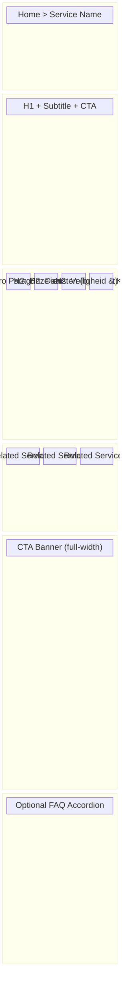

### 15.3 Contact Page Wireframe (Desktop)

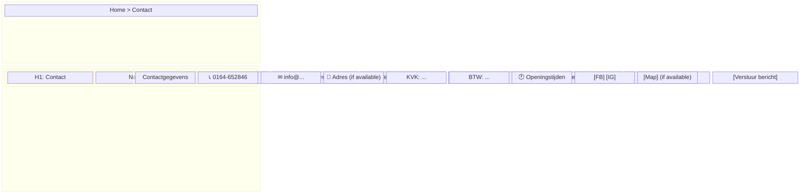

### 15.4 Mobile Navigation Wireframe

```mermaid
block-beta
    columns 1
    block:MobileMenu
        Close["✕ Sluiten"]
        Home["Home"]
        Diensten["▶ Diensten"]
        DienstenSub1["   Glas & Gevel"]
        DienstenSub2["   Schoonmaakdiensten"]
        OverHDS["▶ Over HDS"]
        OverHDSSub1["   Over HDS"]
        OverHDSSub2["   Kwaliteit & Veiligheid"]
        OverHDSSub3["   Referenties"]
        OverHDSSub4["   Vacatures"]
        Luchtreiniging["▶ Luchtreiniging"]
        Contact["Contact"]
        PhoneCTA["📞 Bel ons: 0164-652846"]
    end
```

---

## 16. Traceability

### 16.1 UI Component → RTM Mapping

| UI Component | RTM Requirements |
|---|---|
| Header | UIX-001, ACC-002, ACC-003, ACC-015 |
| Navigation (Desktop + Mobile) | UIX-002, UIX-003, ACC-002, ACC-011, ACC-020 |
| Footer | UIX-004, ACC-002, ACC-015, CMP-011 |
| Breadcrumbs | UIX-006, ACC-002 |
| Hero Section | UIX-008, ACC-004 |
| Service Card Grid | UIX-009, ACC-002, ACC-004 |
| USP Grid | UIX-010, ACC-004 |
| CTA Banner | UIX-011, ACC-002, ACC-008 |
| Testimonial Block | UIX-012, ACC-004 |
| FAQ Accordion | UIX-013, ACC-002 |
| Contact Form (GF-1) | UIX-014, ACC-007, ACC-013, SEC-003 |
| Cookie Banner | UIX-005, ACC-002, CMP-002 |
| Skip-to-Content Link | UIX-007, ACC-003 |
| All Form Elements | ACC-007, ACC-014 |
| All Images | ACC-006 |
| All Buttons & Links | ACC-008 |
| All Pages | ACC-001 (contrast), ACC-004 (headings), ACC-009 (zoom), ACC-012 (language), ACC-013 (titles), ACC-016 (consistency) |

### 16.2 UI Component → Functional Specification Mapping

| UI Component | FS Reference |
|---|---|
| Homepage Layout | FS §4.1 |
| Service Page Layout | FS §4.2 |
| Category Landing Layout | FS §4.3 |
| About Page Layout | FS §4.4 |
| Referenties Page Layout | FS §4.5 |
| Vacatures Page Layout | FS §4.6 |
| Downloads Page Layout | FS §4.7 |
| Contact Page Layout | FS §4.8 |
| Bedankt Page Layout | FS §4.9 |
| WooCommerce Pages | FS §4.10 |
| Search Page | FS §4.11, FS §7 |
| Header | FS §4.13 |
| Footer | FS §4.14 |
| Forms (All) | FS §4.15, FS §6 |
| Cookie Consent | FS §4.16 |
| 404 Page | FS §4.17 |
| Blog Pages | FS §4.20 |
| Navigation Behavior | FS §4.12, FS §8 |
| Error Handling | FS §9 |
| Conversion Flow | FS §5 |

### 16.3 UI Component → NFR Mapping

| UI Component | NFR Reference |
|---|---|
| All Components (Performance) | NFR §3 |
| All Forms (Security) | NFR §6.10 |
| Cookie Banner (Privacy/GDPR) | NFR §7.1 |
| All Pages (Accessibility) | NFR §8 |
| All Pages (SEO) | NFR §9 |
| Error States (Reliability) | NFR §10.1 |
| Header/Navigation/Footer (Compat) | NFR §12.1–12.2 |

### 16.4 UI Component → Solution Architecture Mapping

| UI Component | SA Reference |
|---|---|
| Theme Layer | SA §10 |
| Template Hierarchy | SA §11 |
| Performance (Caching/CDN) | SA §12 |
| Security (6-Layer Model) | SA §13 |
| SEO (Schema, Metadata) | SA §14 |
| Content Architecture | SA §15 |

### 16.5 UI Component → Product Backlog Mapping

| UI Component | PB Story |
|---|---|
| Theme Foundation (all global components) | E-INFRA-06 |
| Block Patterns & Custom Blocks | E-INFRA-07 |
| Design System (tokens, styles) | E-INFRA-08 |
| Homepage | E-CORE-01 |
| Service Pages + Service Cards | E-CORE-02..08 |
| Contact Page + Form | E-CORE-09 |
| Quote Page + Form | E-CORE-10 |
| Bedankt Page | E-CORE-11 |
| Supporting Pages | E-SUPPORT-01..07 |
| WooCommerce UI | E-COMM-01..07 |
| Accessibility Remediation | E-COMPLY-07 |

---

**This UI/UX Architecture & Design System specification is the single source of truth for designers and frontend developers. It provides implementation-ready design tokens, component specifications, layout rules, and accessibility requirements. Every component is traceable to RTM, FS, NFR, SA, and PB documents.**

**END OF UI/UX SPECIFICATION — Version 1.0.0**
