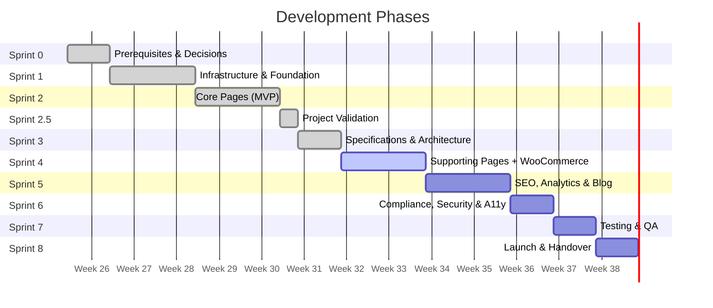
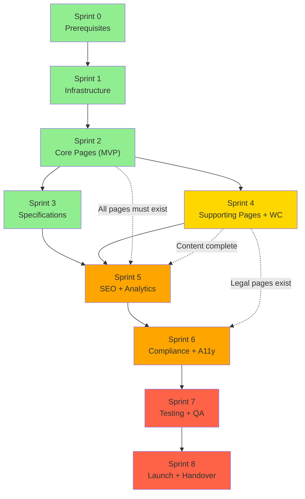
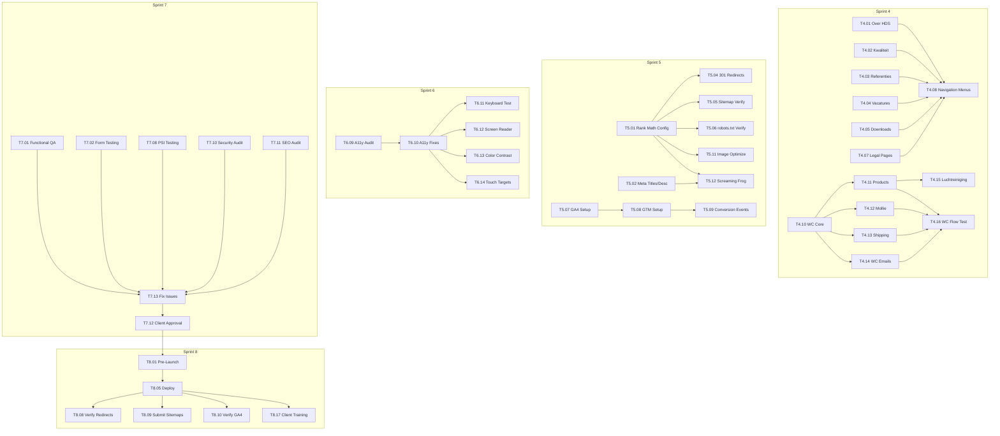

# HDS Onderhoudsdiensten — Development Execution Plan

**Document ID:** DEP-001 | **Version:** 1.0.0 | **Status:** Implementation-Ready
**Project:** helderduidelijkschoon.nl — Ground-Up Rebuild
**Date:** July 2026
**Referenced Documents:** PB-001, RTM-001, FS-001, NFR-001, SA-001, DS-001, WTA-001, SEO-001, PVR-001

---

## 1. Executive Summary

This Development Execution Plan defines the complete implementation roadmap from Sprint 4 kickoff through Sprint 8 launch and 30-day post-launch monitoring. It assigns tasks, defines quality gates, and establishes the verification criteria for every deliverable.

**Current Status:** Sprint 1–2 complete (Epic 1 — Infrastructure, Epic 2 — CMS Architecture). Sprint 3 complete (Specifications + Architecture + SEO + WordPress Tech Architecture + UI/UX). Sprints 0–3 deliverables are verified and accepted.

**Next Action:** Sprint 4 begins with Supporting Pages & Content (E-SUPPORT) and WooCommerce (E-COMM) in parallel tracks.

**Total Remaining Sprints:** 5 (Sprint 4–8)
**Estimated Remaining Effort:** 220 story points across 5 sprints
**Target Completion:** Week 8–9 (Sprint 8 — Launch & Handover)

---

## 2. Development Objectives

| # | Objective | Success Metric | Sprint |
|---|---|---|---|
| DO01 | Build all 32 pages with final Dutch content | Screaming Frog: zero 4xx/5xx on expected pages | Sprints 2–5 |
| DO02 | All 3 forms submit and deliver email within 2 minutes | Manual test on staging + production | Sprint 2, 6 |
| DO03 | WooCommerce purchase flow end-to-end (conditional) | Test order: browse → cart → checkout → payment → email | Sprint 4 |
| DO04 | SEO foundation complete — metadata, schema, sitemaps, redirects | All 28 REQ-SEO requirements validated | Sprint 5 |
| DO05 | PSI Mobile ≥ 90; Lighthouse Accessibility = 100 | Automated + manual audit on all templates | Sprint 6–7 |
| DO06 | GDPR/AVG compliant — cookie consent active, privacyverklaring published | Legal review complete; Complianz scan log verified | Sprint 6 |
| DO07 | Client trained and self-sufficient with Block Editor + forms + shop | 1-hour training session; Beheergids delivered | Sprint 8 |
| DO08 | Launched to production with zero critical defects | 25-point pre-launch checklist all passed | Sprint 8 |

---

## 3. Team Responsibilities

### 3.1 Role Definitions

**Assumption:** Team size is 1–2 developers. Roles below represent responsibilities, not necessarily distinct individuals. A developer may hold multiple roles simultaneously.

| Role | Abbreviation | Primary Responsibilities |
|---|---|---|
| **Project Manager / Scrum Master** | PM | Sprint planning, backlog grooming, client communication, gate checks, risk tracking |
| **Backend Developer** | BE | PHP templates, CPTs, custom fields, Gravity Forms config, WooCommerce config, schema generation, security hardening, plugin configuration |
| **Frontend Developer** | FE | CSS (main.css), JavaScript (main.js, block editor scripts), responsive testing, accessibility remediation, performance optimization |
| **WordPress Developer** | WP | Page creation, content entry, menu configuration, Customizer setup, Rank Math SEO configuration, block pattern registration |
| **Content Editor** | CE | Dutch content writing for all pages (300+ words service, 500+ landings), meta descriptions, alt text, blog posts |
| **SEO Specialist** | SEO | Rank Math Pro configuration, schema validation, sitemap/robots.txt verification, redirect testing, Screaming Frog audits, GSC/GSC setup |
| **QA Engineer** | QA | Cross-browser testing, mobile/tablet testing, accessibility audits (axe, WAVE, Lighthouse), performance testing (PSI, WebPageTest), form testing, WC flow testing |

### 3.2 Responsibility Matrix (RACI)

| Activity | PM | BE | FE | WP | CE | SEO | QA |
|---|---|---|---|---|---|---|---|
| Sprint planning | **R** | C | C | C | I | I | I |
| Theme development | I | **R** | **R** | C | — | — | — |
| Page template building | I | **R** | C | C | — | — | — |
| Custom block development | I | **R** | C | — | — | — | — |
| Block pattern registration | I | **R** | — | C | — | — | — |
| Gravity Forms configuration | I | **R** | — | — | — | — | C |
| Dutch content writing | I | — | — | C | **R** | I | — |
| WooCommerce configuration | I | **R** | — | — | — | — | C |
| SEO metadata + schema | I | C | — | **R** | C | **R** | — |
| Accessibility compliance | I | C | **R** | — | — | — | **R** |
| Performance optimization | I | C | **R** | — | — | — | C |
| Cross-browser testing | I | — | — | — | — | — | **R** |
| Client review coordination | **R** | I | I | — | — | — | — |
| Deployment | I | **R** | — | — | — | — | C |

**Key:** R = Responsible, A = Accountable, C = Consulted, I = Informed

---

## 4. Development Phases

### 4.1 Phase Overview

### 4.2 Phase Descriptions

| Phase | Sprint | Duration | Goal | Deliverables |
|---|---|---|---|---|
| **Preparation** | Sprint 0 | Week 0 | Resolve all blocking decisions | Hosting, domain, theme selection, plugin decisions, legal counsel engaged |
| **Foundation** | Sprint 1 | Week 1–2 | Infrastructure + Theme scaffold | WP installed, plugins active, theme foundation built, CDN/SSL/SMTP/backups configured |
| **Core Pages (MVP)** | Sprint 2 | Week 3–4 | Visitor can discover services and request a quote | Homepage, 7 service pages, Contact form, Quote form, Bedankt, 404 |
| **Validation** | Sprint 2.5 | Week 4 | Cross-document consistency audit | PVR-001 with 31 issues found, 5 high-priority corrections |
| **Specifications** | Sprint 3 | Week 5 | Complete architecture + design + technical specs | SA-001, DS-001, WTA-001, SEO-001, DEP-001 (this document) |
| **Supporting Pages + WC** | Sprint 4 | Week 5–6 | All remaining pages + WooCommerce | About, legal, references, vacancies, downloads, FAQ, WC shop configured |
| **SEO + Analytics** | Sprint 5 | Week 6–7 | Complete SEO foundation | 32 meta titles/descriptions, 9 schema types, sitemaps, redirects, GA4, GTM, image optimization |
| **Compliance + A11y** | Sprint 6 | Week 7 | GDPR, security hardening, accessibility | Cookie consent, Wordfence 2FA, accessibility audit + fixes |
| **Testing + QA** | Sprint 7 | Week 8 | Full test suite execution | All QA gates passed; client approval on staging |
| **Launch + Handover** | Sprint 8 | Week 8–9 | Production deployment + client training | Site live, GSC submitted, GA4 active, Beheergids delivered |

---

## 5. Task Breakdown

### 5.1 Sprint 4 — Supporting Pages (E-SUPPORT)

**Duration:** Week 5 (overlaps with Sprint 3 specification work)
**Effort:** 35 story points | **Team:** 1 developer (BE+WP+CE)

| Task ID | Description | Priority | Est. Hours | Dependencies | Deliverable | AC Ref |
|---|---|---|---|---|---|---|
| T4.01 | Build P11 Over HDS page (500+ words Dutch) | P0 | 3 | E-INFRA-06 (theme) | Page at `/over-hds/` with About template | AC from PB E-SUPPORT-01 |
| T4.02 | Build P12 Kwaliteit & Veiligheid page (300+ words Dutch) | P0 | 2 | E-INFRA-06 | Page at `/kwaliteit-veiligheid/` with About template | AC from PB E-SUPPORT-02 |
| T4.03 | Build P13 Referenties page + configure `hds/testimonial` block | P1 | 5 | E-PREREQ-02 (CPT slug) | Page at `/referenties/` with testimonial block | AC from PB E-SUPPORT-03 |
| T4.04 | Build P14 Vacatures page + configure `hds/job-listing` block | P1 | 5 | MI-12 (vacancy text — assumption if not provided) | Page at `/vacatures/` with job-listing block | AC from PB E-SUPPORT-04 |
| T4.05 | Build P15 Downloads page + migrate PDFs from legacy domain | P1 | 3 | Legacy domain access | Page at `/downloads/` with download cards | AC from PB E-SUPPORT-06 |
| T4.06 | Build P18 Veelgestelde Vragen page (10–15 FAQ items, Yoast FAQ blocks) | P2 | 3 | E-INFRA-06 | Page at `/veelgestelde-vragen/` with FAQ blocks + FAQPage schema | AC from PB E-SUPPORT-07 |
| T4.07 | Build P19–P22 Legal pages (Privacyverklaring, Cookiebeleid, Voorwaarden, Disclaimer) | P0 | 4 | MI-16, MI-17 | 4 pages with Legal template; P20 auto-populated by Complianz | AC from PB E-SUPPORT-05 |
| T4.08 | Configure all 5 navigation menus (primary + 4 footer) | P0 | 2 | All pages exist (P01–P22) | Menus configured in Appearance → Menus | AC-NAV01..09 from FS |
| T4.09 | Set Customizer Company Information (11 fields) | P0 | 1 | MI-01..04 (if available; defaults used as fallback) | Company info populated in Customizer; footer + Contact page + schema consistent | AC from PB |

### 5.2 Sprint 4 — WooCommerce (E-COMM)

**Duration:** Week 5–6 (parallel with E-SUPPORT)
**Effort:** 27 story points | **Team:** 1 developer (BE)
**Conditional:** Client must confirm Airfixr shop remains (MI-15, Q09). If not, Sprint 4 is reduced to ~5 points.

| Task ID | Description | Priority | Est. Hours | Dependencies | Deliverable | AC Ref |
|---|---|---|---|---|---|---|
| T4.10 | Configure WooCommerce core settings (currency, tax, pages, guest checkout) | P1 | 2 | E-INFRA-02 (WC installed) | WC configured per FS §12 settings | AC from PB E-COMM-01 |
| T4.11 | Import 14 Airfixr products from current site | P1 | 3 | E-COMM-01 | Products visible at `/winkel/`. Shop intro 100+ words. | AC from PB E-COMM-02 |
| T4.12 | Configure Mollie payment gateway (test mode) + webhook verification | P0 (cond.) | 3 | MI-15 (gateway choice) | iDEAL + Bancontact + cards + PayPal + SEPA active in test mode | AC from PB E-COMM-03 |
| T4.13 | Configure shipping zones + classes (flat rate, placeholder if MI-14 not provided) | P1 | 2 | MI-14 (shipping costs) | Shipping rates display at checkout | AC from PB E-COMM-04 |
| T4.14 | Configure WooCommerce email notifications (10 types, branded, Dutch) | P1 | 2 | E-INFRA-04 (SMTP) | All 10 email types configured and test-delivered | AC from PB E-COMM-05 |
| T4.15 | Build P23 Luchtreiniging landing page (300+ words) | P1 | 2 | E-COMM-02 (products exist) | Page at `/luchtreiniging/` with product highlights + shop CTA | AC from PB E-COMM-06 |
| T4.16 | Test full WooCommerce purchase flow (guest + logged-in) | P1 | 3 | E-COMM-01..06 | End-to-end test: browse → cart → checkout → payment (test mode) → email | AC from PB E-COMM-07 |

### 5.3 Sprint 5 — SEO, Analytics & Blog

**Duration:** Week 6–7
**Effort:** 53 story points | **Team:** 1 developer (SEO+WP+CE)

| Task ID | Description | Priority | Est. Hours | Dependencies | Deliverable | AC Ref |
|---|---|---|---|---|---|---|
| T5.01 | Configure Rank Math Pro: site type, social image, breadcrumbs, sitemaps, robots.txt | P0 | 3 | All pages exist (Sprints 2–4) | Rank Math Pro fully configured | AC-SEO01..08 |
| T5.02 | Write unique meta title + description for all 32 pages | P0 | 4 | All page content finalized | 32 unique titles (50–60 chars) + descriptions (150–160 chars) | AC-SEO09..10 |
| T5.03 | Validate all 9 schema types (Google Rich Results Test) | P0 | 3 | Schema code complete (inc/schema.php) | Zero errors on all 9 schema types | AC-SEO15..20 |
| T5.04 | Configure 301 redirects (7 rules) in Rank Math Redirect Manager | P0 | 1 | Rank Math configured | All redirects tested; zero chains verified | AC-SEO06 |
| T5.05 | Verify XML Sitemap returns 200 with valid XML | P0 | 0.5 | T5.01 | `sitemap_index.xml` → 200 | AC-SEO01..02 |
| T5.06 | Verify robots.txt returns 200 with correct rules | P0 | 0.5 | T5.01 | robots.txt → 200, sitemap URL present | AC-SEO03 |
| T5.07 | Set up GA4 property + data stream | P0 | 2 | E-PREREQ-08 (GA4 access) | GA4 real-time shows page views | AC-ANL from NFR |
| T5.08 | Set up GTM container + deploy snippet | P0 | 2 | T5.07 | GTM snippet in `<head>` | AC-ANL from NFR |
| T5.09 | Configure GA4 conversion events (phone_click, email_click, form_submission, quote_request, purchase) | P1 | 3 | T5.07, T5.08; forms exist | All 7 events fire in GA4 real-time | AC-ANL from NFR |
| T5.10 | Verify Google Search Console domain property + submit sitemap | P0 | 1 | E-PREREQ-08 | GSC sitemap status = "Success" | AC-SEO32 |
| T5.11 | Image optimization: bulk WebP conversion + alt text audit | P1 | 3 | All images uploaded | WebP format; alt text present on all non-decorative images | AC-SEO24, AC-PERF-07 |
| T5.12 | Screaming Frog crawl: zero broken links, zero orphans, zero missing meta | P0 | 1 | All content complete | Screaming Frog: zero 4xx internal; zero orphan pages; zero empty titles/descriptions | AC-SEO25..26 |
| T5.13 | Write 5 initial blog posts (500+ words each, Dutch) — OPTIONAL, P2 | P2 | 8 | — | 5 blog posts at `/kennisbank/{slug}/` | AC from blog spec |

### 5.4 Sprint 6 — Compliance, Security & Accessibility

**Duration:** Week 7
**Effort:** 30 story points | **Team:** 1 developer (BE+FE)

| Task ID | Description | Priority | Est. Hours | Dependencies | Deliverable | AC Ref |
|---|---|---|---|---|---|---|
| T6.01 | Configure Complianz Premium: cookie banner, per-category consent, consent logging, GTM consent mode v2 | P0 | 3 | Legal pages exist (P19, P20) | Banner appears first visit; no cookies before consent; consent logged | AC-NF25..27 |
| T6.02 | Verify Cookiebeleid page (P20) auto-populated + linked from footer and banner | P0 | 0.5 | T6.01 | `/cookiebeleid/` → 200; content generated | AC-NF30 |
| T6.03 | Configure Wordfence Premium: WAF, custom login URL, 2FA (TOTP), brute force (3 attempts → lockout), daily malware scan | P0 | 3 | E-INFRA-02 (Wordfence installed) | 2FA active on all admin accounts; custom login URL active; brute force functional | AC-NF17..19 |
| T6.04 | Verify XML-RPC disabled (403) at server + theme level | P0 | 0.5 | — | `curl -I /xmlrpc.php` → 403 | AC-NF16 |
| T6.05 | Verify DISALLOW_FILE_EDIT = true | P0 | 0.5 | — | Theme/Plugin File Editor absent from WP Admin | AC-NF21 |
| T6.06 | Verify REST user endpoint blocked | P1 | 0.5 | — | `curl /wp-json/wp/v2/users` → 403 or empty | AC-NF20 |
| T6.07 | Verify all 3 forms: privacy checkbox unchecked by default + links to privacyverklaring | P0 | 1 | Forms exist (GF-1, GF-2, GF-3) | All 3 forms verified | AC-NF29 |
| T6.08 | Configure GDPR data retention: GF entries 12mo auto-delete | P1 | 0.5 | — | Gravity Forms → Settings → Auto-delete configured | AC-CMP from NFR |
| T6.09 | Full accessibility audit: axe DevTools, WAVE, Lighthouse on all page templates | P0 | 4 | All pages built | axe: zero critical/serious; WAVE: zero errors; Lighthouse: 100 | AC-NF34..36 |
| T6.10 | Accessibility remediation: fix all issues from T6.09 | P0 | 4 | T6.09 | All audit issues resolved | AC-NF34..41 |
| T6.11 | Keyboard navigation test: all interactive elements focusable + operable | P1 | 2 | T6.10 | Tab through Home, 2 services, Contact, 1 product — all pass | AC-NF37 |
| T6.12 | Screen reader test: NVDA (Windows) or VoiceOver (Mac) | P1 | 2 | T6.10 | Forms + navigation + content correctly announced | AC from NFR |
| T6.13 | Color contrast audit: all combinations pass WCAG AA | P1 | 1 | T6.10 | WebAIM or axe: all combinations pass | AC-NF39 |
| T6.14 | Touch target audit: all targets ≥ 44px on mobile | P1 | 1 | T6.10 | Manual measurement: all nav/buttons/toggles meet minimum | AC-NF40 |

### 5.5 Sprint 7 — Testing & QA

**Duration:** Week 8
**Effort:** 41 story points | **Team:** 2 developers (BE+FE+QA)

| Task ID | Description | Priority | Est. Hours | Dependencies | Deliverable | AC Ref |
|---|---|---|---|---|---|---|
| T7.01 | Full functional QA: all 32 pages return HTTP 200 | P0 | 2 | All pages built | Screaming Frog: zero 4xx/5xx on expected pages | AC-F01 from FS |
| T7.02 | Form testing: all 3 forms submit and deliver email within 2 minutes | P0 | 2 | SMTP configured (E-INFRA-04) | Contact, Quote, Vacature forms tested; emails delivered | AC-F02, AC-F03 from FS |
| T7.03 | Form validation testing: required fields, email format, postcode format, file upload limits + types | P0 | 2 | Forms exist | All validation rules tested; Dutch error messages verified | AC from FS §6 |
| T7.04 | WooCommerce purchase flow test (if applicable) | P1 | 2 | E-COMM-07 | Full flow: browse → cart → checkout → payment → email | AC-F04 from FS |
| T7.05 | Cross-browser testing: Chrome, Firefox, Safari, Edge (latest 2) | P1 | 3 | All pages built | All 13 page templates render consistently | AC-NF51 |
| T7.06 | Mobile testing: 375px, 768px, 1024px, 1440px | P0 | 2 | All pages built | No horizontal scroll at any breakpoint; mobile menu functional | AC-NF52..53 |
| T7.07 | Real device testing: iPhone 14+ (Safari), Android (Chrome), iPad | P1 | 2 | — | Usable on real devices; touch targets ≥ 44px | AC from NFR |
| T7.08 | Performance testing: PSI Mobile + Desktop on Home, 1 service, 1 product | P0 | 1 | All optimization complete | PSI Mobile ≥ 90; Desktop ≥ 95 | AC-NF01..02 |
| T7.09 | Performance testing: WebPageTest (Amsterdam, Moto G4, 3G Fast) | P0 | 1 | T7.08 | LCP < 2.5s; CLS < 0.1; TTFB < 600ms | AC-NF03..05 |
| T7.10 | Security audit: Wordfence scan clean, xmlrpc blocked, 2FA active, login locked after 3 fails | P0 | 2 | T6.03–6.06 | All 16 SEC requirements verified | AC-NF15..24 |
| T7.11 | SEO audit: Screaming Frog full crawl + check all 35 AC-SEO criteria | P0 | 2 | T5.01–5.12 | All 35 SEO ACs pass | AC-SEO01..35 |
| T7.12 | Client review + approval on staging | P0 | 4 | All QA gates passed | Client sign-off (email or documented) | AC from FS |
| T7.13 | Fix all issues found in T7.01–7.12 | P0 | 4 | Issue list from QA | All issues resolved; re-tested | AC from FS |

### 5.6 Sprint 8 — Launch & Handover

**Duration:** Week 8–9
**Effort:** 34 story points | **Team:** 1 developer (BE+PM)

| Task ID | Description | Priority | Est. Hours | Dependencies | Deliverable | AC Ref |
|---|---|---|---|---|---|---|
| T8.01 | Complete pre-launch checklist (25 items — see §14) | P0 | 2 | All QA gates passed | All 25 items checked | LR01..25 from MPS |
| T8.02 | Take final backup of old live site | P0 | 1 | Old site hosting access | Backup verified via test restore | — |
| T8.03 | Lower DNS TTL to 300 seconds (24h before launch) | P0 | 0.5 | DNS access | TTL verified via whatsmydns.net | — |
| T8.04 | Export staging database + search-replace domain | P0 | 1 | Staging approved | DB ready for production import | — |
| T8.05 | Deploy files to production (GitHub Actions or manual) | P0 | 1 | T8.01–8.04 | Files on production server | — |
| T8.06 | Import database to production | P0 | 1 | T8.04 | Production site displays new content | — |
| T8.07 | Clear all caches: FlyingPress, Cloudflare API, Redis | P0 | 0.5 | T8.05–8.06 | Cache cleared; fresh content served | — |
| T8.08 | Verify all 301 redirects on production domain | P0 | 0.5 | T8.05 | Each redirect tested via httpstatus.io | AC-SEO06 |
| T8.09 | Submit XML sitemap to Google Search Console + Bing Webmaster Tools | P0 | 0.5 | T8.05 | Sitemaps submitted; status monitored | AC-SEO32 |
| T8.10 | Verify GA4 real-time reports show traffic | P0 | 0.5 | T8.05 | GA4 real-time: users visible | AC-ANL from NFR |
| T8.11 | Contact form test submission from production | P0 | 0.5 | T8.05 | Email delivered within 2 minutes | AC-F02 |
| T8.12 | Offerte form test with file upload from production | P1 | 0.5 | T8.05 | Email received with download link | AC-F03 |
| T8.13 | WooCommerce test purchase from production (if applicable) | P1 | 0.5 | T8.05 | Test order → payment → email | AC-F04 |
| T8.14 | Verify HTTPS enforced + HSTS header on production | P0 | 0.5 | T8.05 | SSL Labs A+; securityheaders.com HSTS present | AC-NF15 |
| T8.15 | Restore DNS TTL to normal (24h after launch) | P0 | 0.5 | DNS access | TTL restored | — |
| T8.16 | Screaming Frog crawl of production: zero 4xx/5xx | P0 | 0.5 | T8.07 | Crawl report: zero unexpected errors | AC-F01 |
| T8.17 | Client training: 1-hour session | P0 | 2 | T8.05 | Client can edit pages, view form entries, manage WC orders | OPS-006 |
| T8.18 | Deliver Beheergids (Website Management Guide, Dutch) | P0 | 1 | — | Written guide delivered to client | OPS-006 |
| T8.19 | Transfer admin credentials securely to client | P0 | 0.5 | — | Credentials transferred via secure channel | — |
| T8.20 | Launch readiness report to client | P1 | 1 | T8.01–8.19 | Report: all AC met; site live; monitoring active | — |

---

## 6. Dependency Graph

### 6.1 Critical Path

### 6.2 Task-Level Dependencies

### 6.3 Parallel Execution Opportunities

| Sprint | Parallel Tracks | Description |
|---|---|---|
| Sprint 4 | **Track A:** E-SUPPORT (T4.01–4.09) — 7 supporting pages, all independent | Different templates, different content, no interdependencies. |
| Sprint 4 | **Track B:** E-COMM (T4.10–4.16) — WooCommerce configuration | Sequential within WC (core → products → payments/shipping/emails → flow test). Independent of Track A. |
| Sprint 5 | Most tasks parallel after T5.01 (Rank Math config) | Meta writing, schema validation, analytics setup, image optimization all independent. |
| Sprint 6 | T6.01–6.08 (compliance) parallel with T6.09 (a11y audit) before T6.10 (a11y fixes) | Compliance configuration is independent of accessibility audit. |
| Sprint 7 | T7.01–7.11 (testing) all parallel except T7.13 depends on all | Different test categories are independent. |
| Sprint 8 | T8.08–8.16 (post-deploy verification) all parallel | Each verification is independent after T8.05 deploy. |

---

## 7. Sprint Planning

### 7.1 Sprint 4 — Supporting Pages & WooCommerce

| Attribute | Value |
|---|---|
| **Duration** | 2 weeks (Week 5–6) |
| **Team** | 2 developers (Track A: E-SUPPORT, Track B: E-COMM) |
| **Stories** | E-SUPPORT-01..07 (7 stories, 35 pts) + E-COMM-01..07 (7 stories, 27 pts) |
| **Total Points** | 62 |
| **Key Deliverables** | 7 supporting pages, 4 legal pages, WooCommerce configured, 14 products imported |
| **Gate Check** | All pages return 200; WC test purchase completes; navigation menus configured |

### 7.2 Sprint 5 — SEO, Analytics & Blog

| Attribute | Value |
|---|---|
| **Duration** | 2 weeks (Week 6–7) |
| **Team** | 1 developer (SEO+WP+CE) |
| **Stories** | E-SEO-01..10 (10 stories, 53 pts) |
| **Total Points** | 53 |
| **Key Deliverables** | 32 meta titles/descriptions, 9 schema types validated, sitemap 200, GSC submitted, GA4 active, images optimized |
| **Gate Check** | All 35 AC-SEO criteria pass; Screaming Frog crawl clean |

### 7.3 Sprint 6 — Compliance, Security & Accessibility

| Attribute | Value |
|---|---|
| **Duration** | 1 week (Week 7) |
| **Team** | 1 developer (BE+FE) |
| **Stories** | E-COMPLY-01..07 (7 stories, 30 pts) |
| **Total Points** | 30 |
| **Key Deliverables** | Cookie consent active, Wordfence 2FA, accessibility audit clean, privacyverklaring ready for legal review |
| **Gate Check** | Complianz scan log shows consent events; axe DevTools zero critical/serious; Lighthouse Accessibility = 100 |

### 7.4 Sprint 7 — Testing & QA

| Attribute | Value |
|---|---|
| **Duration** | 1 week (Week 8) |
| **Team** | 2 developers (BE+FE+QA) |
| **Stories** | E-QA-01..08 (8 stories, 41 pts) |
| **Total Points** | 41 |
| **Key Deliverables** | All QA gates passed; client approval on staging |
| **Gate Check** | All 25 pre-launch criteria met; client sign-off obtained |

### 7.5 Sprint 8 — Launch & Handover

| Attribute | Value |
|---|---|
| **Duration** | 1 week (Week 8–9) |
| **Team** | 1 developer (BE+PM) |
| **Stories** | E-LAUNCH-01..09 (9 stories, 34 pts) |
| **Total Points** | 34 |
| **Key Deliverables** | Site live on production; GSC + GA4 active; client trained; Beheergids delivered |
| **Gate Check** | 30-day monitoring period begins; all post-launch checks passing |

---

## 8. Quality Gates

### 8.1 Gate Definitions

| Gate | Sprint | Pass Condition | Blocked If Failed |
|---|---|---|---|
| **G1: MVP Ready** | End of Sprint 2 | All 13 core pages return 200; Contact + Quote forms submit and deliver email | Cannot proceed to Sprint 3 |
| **G2: Content Complete** | End of Sprint 4 | All 32 pages return 200; navigation configured; all forms functional | Cannot begin SEO metadata |
| **G3: SEO Foundation** | End of Sprint 5 | All 35 AC-SEO criteria pass; Screaming Frog clean; GA4 active | Cannot begin final QA |
| **G4: Compliance** | End of Sprint 6 | Cookie consent active; accessibility audit clean; security hardened | Cannot begin UAT |
| **G5: QA Passed** | End of Sprint 7 | All 56 AC-NF criteria pass; client approved staging | Cannot launch |
| **G6: Launch Ready** | Pre-deploy Sprint 8 | All 25 pre-launch checklist items checked | Cannot deploy to production |
| **G7: Go-Live** | Post-deploy Sprint 8 | Site live; HTTPS enforced; sitemaps submitted; GA4 active | Rollback to old site |
| **G8: Stable** | 30 days post-launch | Zero critical crawl errors; Core Web Vitals meeting targets; forms delivering email | — |

### 8.2 Gate Verification Responsibilities

| Gate | Verifier | Evidence |
|---|---|---|
| G1 | BE Developer | Screaming Frog crawl report; email delivery screenshots |
| G2 | WP Developer | Manual page audit; navigation menu screenshots |
| G3 | SEO Specialist | Screaming Frog crawl report; Google Rich Results Test; GA4 real-time screenshot |
| G4 | FE Developer + BE Developer | Complianz scan log; axe DevTools report; Wordfence dashboard screenshot |
| G5 | QA Engineer + Client | QA test report; client approval email |
| G6 | PM + BE Developer | Pre-launch checklist (all 25 items with status) |
| G7 | BE Developer | Production URL loads; SSL Labs A+; GSC sitemap status; GA4 real-time |
| G8 | PM (monthly review) | GSC report; PSI report; GF entries log |

---

## 9. Testing Strategy

### 9.1 Test Categories

| Test Type | What is Tested | Tools | Sprint | Owner |
|---|---|---|---|---|
| **Functional** | All 32 pages return correct HTTP status; all links resolve; all 3 forms submit and deliver email; WC purchase flow | Manual + Screaming Frog | Sprint 7 | QA |
| **Form Validation** | Required fields; email format; postcode format; file upload size/type; privacy checkbox; reCAPTCHA | Manual | Sprint 7 | QA |
| **Cross-Browser** | Chrome, Firefox, Safari, Edge (latest 2 versions each) | Manual + BrowserStack (optional) | Sprint 7 | QA |
| **Responsive** | 375px, 768px, 1024px, 1440px; mobile menu; touch targets | Manual + Chrome DevTools | Sprint 7 | QA |
| **Mobile Real Device** | iPhone 14+ (Safari), Android (Chrome), iPad | Manual | Sprint 7 | QA |
| **Accessibility** | axe DevTools, WAVE, Lighthouse, keyboard navigation, screen reader, color contrast, 200% zoom | Automated + Manual | Sprint 6–7 | FE + QA |
| **Performance** | PSI Mobile + Desktop, WebPageTest, GTmetrix, DebugBear | Automated | Sprint 7 | QA |
| **SEO** | Screaming Frog full crawl, Google Rich Results Test, httpstatus.io for redirects, GSC verification | Automated + Manual | Sprint 5, 7 | SEO |
| **Security** | Wordfence scan, xmlrpc 403 check, custom login URL, 2FA, brute force lockout, REST user block | Manual | Sprint 6–7 | BE |
| **GDPR** | Cookie consent banner, no cookies before consent, consent logging, form consent checkboxes, privacyverklaring links | Manual | Sprint 6 | BE |
| **User Acceptance** | Client reviews all pages, submits all forms, browses WC shop | Manual (client) | Sprint 7 | Client + PM |

### 9.2 Test Data Requirements

| Test | Data Needed |
|---|---|
| Contact form | Test name, email, phone, message for valid submission. Empty fields for validation test. |
| Quote form | Dutch postcode (1234 AB). Valid PDF (1MB). Oversized file (6MB). Invalid file (.exe renamed to .pdf). |
| WC purchase | Test Mollie API keys. Test product. Test customer email. |
| Search | "glasbewassing" → expect Glasbewassing page as first result. "xyzzy" → expect "Geen resultaten". |

### 9.3 Regression Testing

**When:** Before every production deployment (Sprint 8+), after every major plugin/theme update (post-launch).

**Scope:** Smoke tests only — not full regression. Tests: Homepage loads, 1 service page loads, Contact form submits, WC product loads, mobile menu works.

**If smoke tests fail:** Deployment is blocked. Issue is investigated and fixed on staging. Re-deploy after fix.

---

## 10. Migration Execution

### 10.1 Pre-Migration (Before Old Site Offline)

| # | Task | Tool | Owner | Sprint |
|---|---|---|---|---|
| M01 | Full Screaming Frog crawl of current site | Screaming Frog | SEO | Sprint 2 |
| M02 | Export GSC data (16 months) | GSC Export | SEO | Sprint 2 |
| M03 | Document all backlinks | Ahrefs / Semrush / GSC | SEO | Sprint 2 |
| M04 | Export GBP data (NAP, categories, reviews) | GBP Dashboard | Client | Sprint 0 |
| M05 | Screenshot every current page | Manual or browser script | WP | Sprint 2 |
| M06 | Export current site media library | WP Admin → Tools → Export | BE | Sprint 2 |
| M07 | Export WooCommerce products, orders, customers | WC → Export | BE | Sprint 4 |
| M08 | Download all PDFs from legacy domain | Manual FTP/SFTP | BE | Sprint 4 |
| M09 | Verify domain registrar login credentials | Manual | Client + PM | Sprint 0 |
| M10 | Document current DNS records | Manual (dig / nslookup) | BE | Sprint 8 |

### 10.2 Content Migration

**Strategy:** Manual migration with rewrite. No automated migration tool. Existing content is too thin and inconsistent to automate.

| Content | Approach |
|---|---|
| Service pages (Glasbewassing, Gevelreiniging, Vloeronderhoud, VVE Service, Oplevering Schoonmaak) | Migrate existing Dutch copy. Expand to 300+ words. Add H2/H3 headings, cross-links, CTAs. |
| Reguliere Schoonmaak, Industriele Schoonmaak | Write entirely new content (was 404 and 60 words). |
| Homepage, About pages, Referenties, Vacatures, Downloads, Contact | Write entirely new content (was broken, thin, or image-based). |
| WooCommerce products | Import via CSV/WC export. Verify prices, images, stock. |
| Blog posts | No migration — all new content. Old "Hello World" post → 410 Gone. |

### 10.3 Redirect Migration

All 9 redirect rules configured in Rank Math Pro Redirect Manager (see SEO-001 §2.4). Tested on staging before Sprint 8 deployment. Re-tested on production immediately after deployment.

### 10.4 SEO Migration

See SEO-001 §10 for the complete migration monitoring plan.

### 10.5 Validation

| Milestone | Validation |
|---|---|
| Post-migration (staging) | Screaming Frog crawl: zero 4xx internal links. All redirects working. |
| Post-deployment (production) | Contact form test. Offerte form test. WC test purchase. GSC sitemap submitted. |

### 10.6 Rollback Plan

**If critical issues are discovered within 24 hours of launch:**

1. Revert DNS to old site (if old site still on old hosting) OR restore old site backup.
2. Communicate to client: issue identified, rollback in progress, ETA.
3. Document issue and resolution.
4. Fix on staging, re-test, re-launch.

**Rollback Time Objective:** < 2 hours from decision to old site operational.

---

## 11. Deployment Checklist

### 11.1 Staging Deployment

- [ ] All changes committed and pushed to `staging` branch
- [ ] GitHub Actions deploys to staging successfully
- [ ] All PHPCS/ESLint/Stylelint checks pass in CI
- [ ] `wp cache flush` executed
- [ ] `wp rewrite flush` executed
- [ ] Staging verified: homepage loads, contact form works, admin login works
- [ ] Client notified: "New changes on staging for review"

### 11.2 Production Deployment

- [ ] Staging tested and approved by client (G5 QA Gate passed)
- [ ] Full backup of staging environment taken
- [ ] `staging` branch merged to `main` branch
- [ ] GitHub Actions: pre-deploy backup triggered
- [ ] GitHub Actions: rsync files to production
- [ ] Database: export from staging; search-replace domain; import to production
- [ ] `wp cache flush` on production
- [ ] Cloudflare cache purged (API call)
- [ ] `wp rewrite flush` on production
- [ ] HSTS header verified on production
- [ ] SSL verified (SSL Labs A+)

### 11.3 DNS

- [ ] DNS TTL lowered to 300 seconds (24 hours before launch)
- [ ] TTL change verified via whatsmydns.net
- [ ] A record / CNAME pointing to production server IP
- [ ] MX records documented and unchanged
- [ ] SPF, DKIM, DMARC records verified
- [ ] TTL restored to 3600 (24 hours after launch)

### 11.4 SSL

- [ ] Cloudflare SSL/TLS: Full (Strict)
- [ ] Origin certificate installed (Let's Encrypt or Cloudflare Origin CA)
- [ ] "Always Use HTTPS" enabled in Cloudflare
- [ ] HSTS header present: `max-age=31536000; includeSubDomains; preload`
- [ ] SSL Labs grade A+
- [ ] `securityheaders.com` check passed (HSTS present)

### 11.5 Caching

- [ ] FlyingPress page cache active on production
- [ ] Redis object cache active on production
- [ ] Cloudflare cache bypass rules verified for WC pages
- [ ] `CF-Cache-Status: BYPASS` on `/winkelmand/`, `/afrekenen/`, `/mijn-account/`
- [ ] `CF-Cache-Status: HIT` (or MISS) on public pages

### 11.6 Monitoring

- [ ] UptimeRobot monitoring active for `helderduidelijkschoon.nl`
- [ ] UptimeRobot alert contacts configured (Developer + Client)
- [ ] Wordfence daily malware scan active
- [ ] Weekly backup verified (test restore)

### 11.7 Search Console

- [ ] GSC domain property verified
- [ ] XML Sitemap submitted
- [ ] Sitemap status = "Success"
- [ ] robots.txt accessible and correct
- [ ] GSC email alerts configured for crawl errors

### 11.8 Analytics

- [ ] GA4 property verified
- [ ] GTM container published
- [ ] GA4 real-time report shows page views from production
- [ ] Conversion events fire: `phone_click`, `email_click`, `form_submission`, `quote_request`
- [ ] Consent Mode v2 verified (GA4 hits restricted before cookie consent)

---

## 12. Risk Management

### 12.1 Risk Register

| ID | Risk | Category | Probability | Impact | Mitigation | Status |
|---|---|---|---|---|---|---|
| R01 | Client delays providing required information (MI-01..25) | Timeline | High | High | Conditional rendering; assumptions documented; early communication of deadlines | ⚠ Active |
| R02 | SMTP misconfiguration → silent email failure | Technical | Medium | Critical | SPF/DKIM/DMARC configured; Post SMTP log enabled; 2-minute email delivery test as Sprint 1 gate | ✅ Mitigated |
| R03 | WooCommerce + Cloudflare cache conflict | Technical | Low | High | Cache bypass rules for WC pages; verified via CF-Cache-Status headers before launch | ✅ Mitigated |
| R04 | CPT slug conflict (hds_testimonial vs /referenties/) | Technical | None | — | CPT = public=false; block-queried only | ✅ Resolved |
| R05 | DNS propagation delay at launch | Migration | Medium | Medium | TTL lowered to 300s 24h before launch; verified via whatsmydns.net | ✅ Planned |
| R06 | Backup not verified before old site takedown | Migration | Low | Critical | Test restore to staging verified before old site offline | ✅ Planned |
| R07 | Performance degrades post-launch without monitoring | Technical | Medium | Medium | Weekly PSI checks; staging test before every plugin update | ✅ Planned |
| R08 | Legal review of privacyverklaring not completed before launch (MI-17) | Compliance | Medium | Critical | Lawyer engaged in Sprint 0; draft content ready Sprint 3; hard deadline before Sprint 7 | ⚠ Active |
| R09 | reCAPTCHA v3 blocks legitimate users | Technical | Low | Medium | Honeypot catches most spam; phone fallback on form pages; monitor form completion rate | ✅ Mitigated |
| R10 | Client removes Airfixr shop (Q09) | Scope | Medium | Medium | WC core remains; product/payment stories skipped; Sprint 4 scope reduced | ⚠ Conditional |
| R11 | Content writing takes longer than estimated | Timeline | Medium | Medium | Structural content first (H2 sections, bullet lists); expand prose in later sprint if needed | ✅ Mitigated |
| R12 | Plugin conflict discovered late (e.g., Complianz + FlyingPress) | Technical | Low | Medium | All plugins are well-established premium plugins; test interaction during Sprint 6 | ✅ Mitigated |
| R13 | Staff unavailability (1-developer bottleneck) | Timeline | Low | High | All tasks scoped for 1 developer where possible. Critical path only depends on sequential dependencies. | ⚠ Monitored |
| R14 | Budget exceeded before launch | Commercial | Medium | High | Fixed-scope specification. Change requests as separate scope and cost. | ⚠ Monitored |

### 12.2 Risk Response Strategy

| Risk Level | Response |
|---|---|
| **Critical** | Escalate to PM + Client immediately. Allocate additional resources. Adjust timeline. |
| **High** | Active monitoring. Pre-defined contingency plan. Trigger if risk materializes. |
| **Medium** | Tracked in risk register. Reviewed weekly at sprint retrospective. |
| **Low** | Accepted. No active mitigation beyond documentation. |

---

## 13. Release Strategy

### 13.1 Alpha (Internal Testing)

| Attribute | Value |
|---|---|
| **Environment** | Staging |
| **Audience** | Developer only |
| **Goal** | All pages render. All forms submit. No PHP/JS errors. |
| **Gate** | Developer self-test passes all basic functionality. |

### 13.2 Beta (Client Review)

| Attribute | Value |
|---|---|
| **Environment** | Staging (password-protected, noindex) |
| **Audience** | Client + Developer |
| **Goal** | Client reviews all pages, submits all forms, browses shop. |
| **Gate** | Client sign-off (Sprint 7 G5 gate). |

### 13.3 Release Candidate

| Attribute | Value |
|---|---|
| **Environment** | Staging (production mirror) |
| **Audience** | Developer + QA |
| **Goal** | All QA gates passed. All 25 pre-launch criteria met. |
| **Gate** | G6 launch-ready gate. |

### 13.4 Production

| Attribute | Value |
|---|---|
| **Environment** | Production (`helderduidelijkschoon.nl`) |
| **Audience** | Public |
| **Goal** | Site live. HTTPS enforced. Forms working. GA4 active. |
| **Gate** | G7 go-live gate. 30-day monitoring period begins. |

---

## 14. Go-Live Checklist

**All 25 items must be checked before deployment to production.**

### Content
- [ ] All 32 pages published with final Dutch content
- [ ] All service pages ≥ 300 words
- [ ] All category landings ≥ 500 words
- [ ] No lorem ipsum or placeholder text
- [ ] Phone and email correct on all pages

### Design / UX
- [ ] Responsive on mobile (375px), tablet (768px), desktop (1024px+)
- [ ] Color contrast meets WCAG AA on all pages
- [ ] Navigation works on all devices
- [ ] No broken images

### Functionality
- [ ] All 3 forms submit and deliver emails within 2 minutes
- [ ] WooCommerce purchase flow tested end-to-end (if applicable)
- [ ] Search returns relevant results
- [ ] 404 page works (returns true HTTP 404)
- [ ] Cookie consent banner works (first visit)

### SEO
- [ ] Every page has unique title + meta description
- [ ] All OpenGraph + Twitter Card tags present
- [ ] All schema validated (Google Rich Results Test)
- [ ] XML Sitemap working (HTTP 200, valid XML)
- [ ] All 301 redirects working; zero redirect chains
- [ ] Internal links: zero broken, zero orphans

### Technical
- [ ] HTTPS enforced + HSTS header present
- [ ] XML-RPC disabled (HTTP 403)
- [ ] 2FA on all admin accounts
- [ ] Daily backups configured + test restore verified
- [ ] Caching active + CDN active

---

## 15. Post-Launch Checklist

### 15.1 Immediate (Within 1 Hour)

- [ ] Homepage loads on desktop + mobile
- [ ] Contact form test submission → email delivered
- [ ] Phone + email links work (`tel:` + `mailto:`)
- [ ] All navigation links work
- [ ] SSL valid (browser padlock icon)
- [ ] GA4 real-time shows users

### 15.2 Day 1

- [ ] GSC: submit sitemap, check for errors
- [ ] Check all email notifications working (Contact, Quote, WC)
- [ ] Server error logs clean (`debug.log`)
- [ ] Backup completed successfully
- [ ] Screaming Frog: zero unexpected 4xx/5xx
- [ ] Test on real mobile + tablet
- [ ] Verify GBP + social links

### 15.3 Week 1

- [ ] Monitor GSC daily for crawl errors
- [ ] Monitor Core Web Vitals in GSC
- [ ] Check GA4 conversion events firing
- [ ] Review Wordfence security logs
- [ ] Check form submissions flowing to info@
- [ ] Check spam rate on forms (< 10% spam)

### 15.4 Week 2

- [ ] Submit all new URLs for indexing (GSC URL Inspection)
- [ ] Compare indexed pages to pre-migration baseline
- [ ] Compare search impressions to pre-migration baseline
- [ ] Check keyword rankings vs baseline
- [ ] Performance re-test: PSI Mobile + Desktop

### 15.5 Week 4 (30-Day Review)

- [ ] Full SEO audit vs baseline (Screaming Frog + GSC)
- [ ] Report to client: traffic, conversions, rankings, technical health
- [ ] Check all plugin/core updates
- [ ] Review Wordfence security logs
- [ ] Client satisfaction check

---

## 16. Success Metrics

### 16.1 Technical Metrics

| Metric | Target | Measurement Tool | Frequency |
|---|---|---|---|
| **PSI Mobile Score** | ≥ 90 | PSI | Weekly (post-launch) |
| **PSI Desktop Score** | ≥ 95 | PSI | Weekly |
| **LCP** | < 2.5s | PSI / GSC CWV report | Weekly |
| **CLS** | < 0.1 | PSI / GSC CWV report | Weekly |
| **Uptime** | ≥ 99.9% | UptimeRobot | Continuous |
| **SSL Expiry** | > 30 days | UptimeRobot + Cloudflare | Daily |
| **404 Errors (new)** | < 5/week (unexpected) | GSC + Rank Math 404 Monitor | Weekly |
| **Form Submission Errors** | 0 | Post SMTP log + GF entries | Weekly |
| **Backup Success Rate** | 100% | Backup plugin dashboard | Weekly |

### 16.2 Business Metrics

| Metric | Baseline | 3-Month Target | 6-Month Target | Measurement |
|---|---|---|---|---|
| **Organic Sessions** | TBD (post-GSC export) | +30% | +50% | GA4 |
| **Contact Form Submissions** | 0 (broken on current site) | ≥ 5/month | ≥ 10/month | GF entries (filter by organic source) |
| **Quote Request Submissions** | 0 (did not exist) | ≥ 3/month | ≥ 5/month | GF entries |
| **Phone Clicks (tel:)** | Not tracked | Baseline established | +20% | GA4 `phone_click` event |
| **Indexed Pages** | ~12 (sitemap broken) | 30+ | 30+ | GSC |
| **Avg. SERP Position** | TBD (post-GSC export) | Stable or improved | Improved | GSC |
| **Bounce Rate (Organic)** | TBD | < 60% | < 50% | GA4 |

### 16.3 Quality Metrics

| Metric | Target | Measurement |
|---|---|---|
| **Lighthouse Accessibility** | 100 on all templates | Lighthouse |
| **axe DevTools Issues** | Zero critical, zero serious | axe DevTools |
| **HTML Validation Errors** | < 5 per page | W3C Validator |
| **Broken Internal Links** | 0 | Screaming Frog |
| **Orphan Pages** | 0 | Screaming Frog |

---

## 17. Traceability

### 17.1 Development Phase → RTM Mapping

| Phase | Sprint | RTM Categories Covered |
|---|---|---|
| Preparation | Sprint 0 | BR-009, BR-011, BR-018, CMP-007 |
| Foundation | Sprint 1 | TR-001..037, SEC-001..016, PERF-007..014, ACC-002..005, ACC-009..012, ACC-015..016, UIX-001..004 |
| Core Pages (MVP) | Sprint 2 | FR-001..021, CON-001..010, CON-016..017, CON-028..029, SEC-003..006, SEO-001..007, SEO-012, SEO-014..015 |
| Supporting Pages + WC | Sprint 4 | FR-014..015, FR-022..027, FR-041..048, CON-011..015, CON-018..022, WC-001..012 |
| SEO + Analytics | Sprint 5 | SEO-001..028, ANL-001..010, PERF-007..011 |
| Compliance + A11y | Sprint 6 | CMP-001..013, SEC-007..010, ACC-001..020 |
| Testing + QA | Sprint 7 | PERF-001..006, ACC-001..020, SEO-001..028, SEC-001..016 |
| Launch + Handover | Sprint 8 | OPS-001..006, MIG-007..011 |

### 17.2 Task → PB Story Mapping

| Task | PB Story |
|---|---|
| T4.01–4.09 | E-SUPPORT-01..07 |
| T4.10–4.16 | E-COMM-01..07 |
| T5.01–5.13 | E-SEO-01..10 |
| T6.01–6.14 | E-COMPLY-01..07 |
| T7.01–7.13 | E-QA-01..08 |
| T8.01–8.20 | E-LAUNCH-01..09 |

### 17.3 Task → FS Mapping

| Task | FS Section |
|---|---|
| T4.01 | FS §4.4 (About pages) |
| T4.03 | FS §4.5 (Referenties) |
| T4.04 | FS §4.6 (Vacatures) |
| T4.06 | FS §4.20 (FAQ) |
| T4.07 | FS §4.19 (Legal pages) |
| T5.02 | FS §11.1 (Metadata) |
| T5.03 | FS §11.4 (Schema) |
| T7.02 | FS §6 (Form specifications) |

### 17.4 Task → NFR Mapping

| Task | NFR Section |
|---|---|
| T6.01 | NFR §7.1 (Cookie consent) |
| T6.03 | NFR §6.1 (Authentication), NFR §6.5 (Rate limiting) |
| T6.09 | NFR §8 (Accessibility) |
| T7.08 | NFR §3.1 (Core Web Vitals) |
| T7.10 | NFR §6 (Security) |

### 17.5 Task → Architecture Mapping

| Task | Architecture Doc |
|---|---|
| All template tasks (T4.01–4.07) | WTA-001 §9 (Template Mapping), SA-001 §11 |
| All WC tasks (T4.10–4.16) | WTA-001 §13 (WooCommerce) |
| All SEO tasks (T5.01–5.13) | SEO-001 (full document), SA-001 §14 |
| All compliance tasks (T6.01–6.14) | SA-001 §13 (Security), WTA-001 §15 (Security) |
| All deployment tasks (T8.01–8.20) | SA-001 §16 (Deployment), WTA-001 §18 (Deployment) |

---

**This Development Execution Plan is the definitive implementation roadmap. Every phase, every task, every quality gate, and every verification criterion is defined. The plan is traceable to RTM-001 (274 requirements), PB-001 (76 stories), FS-001 (all sections), NFR-001 (all sections), SA-001, DS-001, WTA-001, and SEO-001.**

**The development team should follow this plan for Sprint 4 through Sprint 8 execution. The Project Manager should use the quality gates (§8) and go-live checklist (§14) to track progress and approve phase transitions.**

**END OF DEVELOPMENT EXECUTION PLAN — Version 1.0.0**
